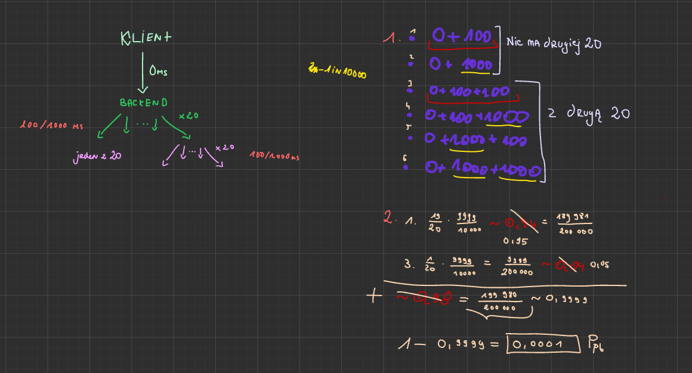

## Zad. 1

- **w losowej kolejności** - żeby sprawdzić, jak testy od siebie zależą, czy jakaś zależność nie jest kluczowa, czy czegoś nie przeoczyliśmy,
- **kilkukrotnie z wymogiem, że muszą przejść co najmniej raz** - żeby zobaczyć, czy testy nie przechodzą przypadkiem, czy istnieje konfiguracja, w której jakiś konkretny test nie przechodzi,
- **kilkukrotnie z wymogiem, że muszą przejść za każdym razem** - żeby sprawdzić, czy się uzupełniają, czy ich kolejność i zależności między sobą nie wykluczają ich przechodzenia, tak działają integracyjne testy wsm,

Czy te funkcje są dostępne w np. Pythonie? Tak:
- **losowo** - `pytest --random--order` - https://pypi.org/project/pytest-random-order/,
- **co najmniej raz** - `pytest --reruns 5` - https://pypi.org/project/pytest-rerunfailures/#pytest-rerunfailures,
- **za każdym razem** - `pytest --count=5` - https://pypi.org/project/pytest-repeat/,

## Zad. 2

Pytania:
- jak wyglądało zużycie średnie i maksymalne zasobów w zeszłym roku?
- czy i jakie nowe projekty, procesy planujemy uruchomić?
- jak to może dodatkowo obciążyć?
- czy spodziewany jest wzrost liczby użytkowników?
- czy przewidujemy migrację danych?
- ile rzeczy chcemy wprowadzić, a ile wycofać?
- jakie mamy standardy bezpieczeństwa?
- ile mamy budżetu na przyszły rok?
- jak dużego zapasu, rezerwy potrzebujemy?

Reasumując, potrzebujemy danych historycznych, planów biznesowych, planów IT, polityki zarządzania zasobami, budżetu i rezerw bezpieczeństwa.

## Zad. 3

**YAML** - format tekstowy służący do zapisu danych w sposób jak najbardziej czytelny, używa się go w configach Dockera, Kubernetesa itd.

Cechy charakterystyczne składni:
- klucz-wartość:
```
nazwa: Jan
wiek: 30
aktywny: true
```
- zagnieżdżenia:
```
uzytkownik:
  imie: Jan
  nazwisko: Kowalski
  adres:
    miasto: Warszawa
    kod: 00-001
```
- listy (mogą być też listy obiektów):
```
owoce:
  - jabłko
  - gruszka
  - banan
```
- typy danych: liczby, boole, nulle, stringi (w tym wielolinijkowe),

Problemy i pułapki:
- wcięcia i spacje,
- dwuznaczności w typach, 
- znaki specjalne (:, #, itd) muszą być w cudzysłowach,
- trudności w debugowaniu,
- brak jednoznaczności przy listach i mapach, trzeba być bardzo konsekwentnym w stylu pisania

Różnica między `|` a `>` w wielolinijkowych tekstach:
```yaml
opis: |
  To jest tekst
  w wielu liniach.
  Każda linia zostanie zachowana.
``` 
będzie sparsowane jako:
```
To jest tekst
w wielu liniach.
Każda linia zostanie zachowana.
```
z kolei:
```yaml
opis: >
  To jest tekst
  w wielu liniach.
  YAML zamieni go na jeden.
```
będzie sparsowane jako:
```
To jest tekst w wielu liniach. YAML zamieni go na jeden.
```

## Zad. 4

**Jinja2** - silnik szablonów dla Pythona, pozwala generować teksty, np. HTML, configi, YAMLe na podstawie szablonów i danych wejściowych. Jest stosowany we frameworkach webowych, takich jak Flask, Django itd. 

Jakiś przykład z chata:
```
from jinja2 import Template

template = Template("Witaj {{ name }}!")
print(template.render(name="Jan"))
# wynik: Witaj Jan!
```

## Zad. 5

0,9999 * 100000 = 99990, czyli 10 pracowników 

## Zad. 6

**Bigtable** - rozproszony, skalowalny system przechowywania danych opracowanych przez Google, przeznaczony na dużych zbiorach danych (setki TB, a nawet PB) na tysiącach maszyn, używany w Google Search, Gmail i Google Maps.

Model danych: trójwymiarowa tabela (wiersz, kolumna, wersja), wiersze identyfikowane unikalnym kluczem (string), dane sortowane wg kluczy wierszy, kolumny grupowane w rodziny kolumn, rodziny określają logiczne powiązanie danych, np. `user:email`, `user:phone`. Wersje to znaczniki czasu, żeby przechowywać wiele wersji jednej danej. 

Architektura:
- master server - koordynuje działanie systemu, przydziela fragmenty tabel do serwerów, monitoruje awarie i migruje dane,
- tablet servers - przechowują i obsługują fragmenty tabel (tablety - zakresy wierszy z tabeli), obsługują odczyt/zapis od klientów,
- chubby - zapewnia rozproszony konsensus (?) i trzyma metadane systemu,
- ustala, który serwer jest masterem, kto jest właścicielem tabletów itd.

Przechowywanie danych:
- memtable - nowe dane trafiają do logu i do struktur w pamięci,
- SStable - posortowany, niemodyfikowalny plik zawierający pary klucz-wartość, gdy memtable się zapełni, dane są flushowane na dysk do SStable,
- kompakcja - łączenie i porządkowanie SStabel, żeby ograniczyć fragmentację i liczbę plików

## Zad. 7

- jaki problem rozwiązuje funkcjonalność?
- po co ona klientowi?
- jakie są korzyści?
- jakie są oczekiwane efekty?
- jakie są wymagania funkcjonalne/niefunkcjonalne, ograniczenia itd?
- kto będzie korzystał, kto będzie właścicielem, czyjej zgody potrzebujemy?
- czy wymaga integracji, czy zależy od innych modułów?
- priorytet, deadline, czy w etapach, czy od razu całość?
- poprawność, jakie testy, czy wszystkie potrzebne?
- ryzyka, utrzymanie po wdrożeniu

## Zad. 8


## Zad. 9

https://etckeeper.branchable.com/README/


