# Procesy

**Proces** - instancja działającego programu, nie mylić z programem, który jest szerszym pojęciem. Proces daje każdemu programowi:
- logiczną kontrolę przepływu - każdy program wykorzystuje procesor na swój własny sposób, jądro gwarantuje "context switching", czyli zmianę trybów między trybem jądra a użytkownika,
- Prywatną przestrzeń adresową - każdy program ma swój użytek pamięci, jądro zapewnia pamięć wirtualną, z której adresy tłumaczony są na fizyczne.

Komputer może przeprowadzać jednocześnie wiele procesów, przykładem są zadania w tle, także kilka aplikacji otwartych naraz. Dokładniej rzecz biorąc, jeden procesor może jednocześnie wywoływać wiele procesów (multitasking), wielordzeniowe procesory współdzielą pamięć i niektóre cache, każdy jest w stanie odpowiadać za osobny proces, jądro odpowiada za podział procesorów na rdzenie.

**Współbieżne procesy** - trwają równocześnie, przeplatają się w czasie,

**Sekwencyjne procesy** - odbywają się jeden po drugim, bez przeplotów

**Jądro** - współdzielony fragment kodu systemu operacyjnego znajdujący się w pamięci, odpowiada między innymi za context switch między dwoma procesami.

Funkcje systemowe na linuxie zazwyczaj zwracają -1 i ustawiają zmienną globalną `errno` oznaczającą powód errora. Nie jest to jednak reguła, nie zawsze trzeba wychodzić z programu, gdy coś pójdzie nie tak.

```c
pid_t getpid(void) 
// zwraca pid tego procesu
pid_t getppid(void)
// zwraca pid rodzica tego procesu
```

3 stany procesów:
- w trakcie - albo jest wykonywany, albo czeka na bycie wykonanym, będzie zaplanowany przez jądro,
- zatrzymany - wstrzymany, i nie będzie zaplanowany do konkretnego momentu (sygnał, ale to potem),
- zakończony - zatrzymany na zawsze

Kończenie procesów:
- otrzymanie sygnału, którego podstawowym zadaniem jest zakończyć proces,
- powrót z maina,
- wywołanie `exit`

```c
void exit(int status)
```
Kończy proces z konkretnym statusem, konwencja: status zwykłego powrotu to 0, niezerowy to error, inny sposób, żeby jawnie ustawić status to zwrócić konkretnego inta w mainie, EXIT JEST WOŁANY RAZ I NIGDY NIE ZWRACA!

```c
int fork(void)
```
Zwraca 0 dla procesu dziecka, PID dziecka dla procesu rodzica (uwaga, zwraca 2 rzeczy, dla rodzica i dziecka). Dziecko jest prawie identyczne jak rodzic:
- ma identyczną, ale oddzielną kopię wirtualnej przestrzeni adresowej rodzica, 
- ma identyczne kopie otwartych deskryptorów plików rodzica,
- ma inne PID niż rodzic

Przykłady forków z grafami przepływu:

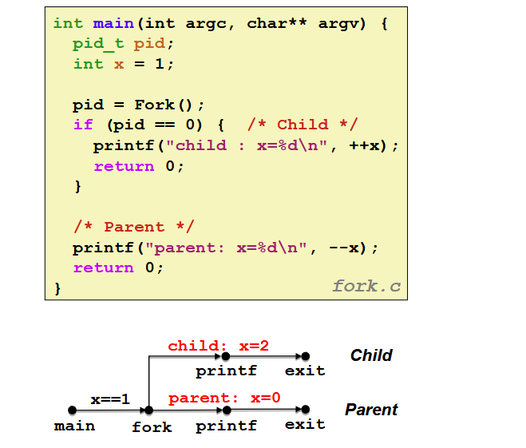
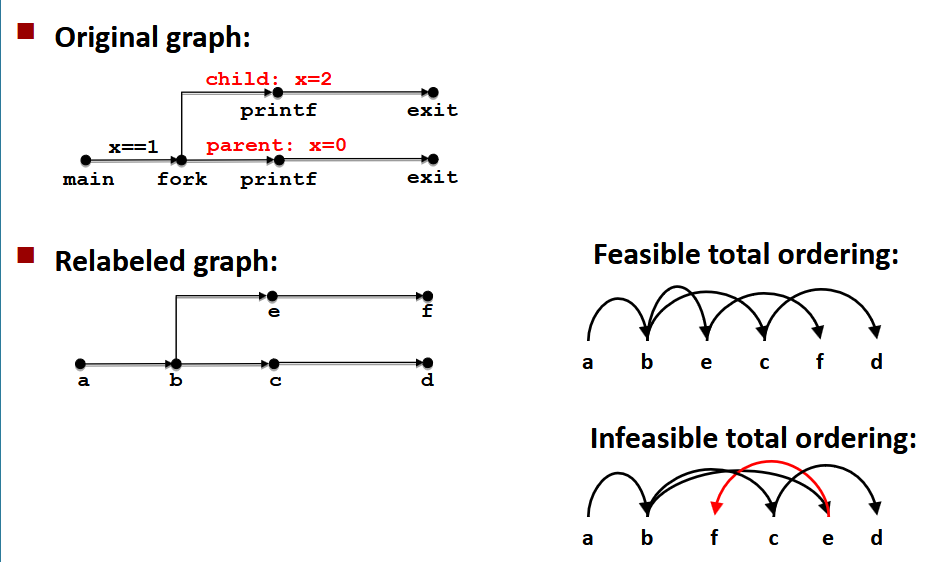
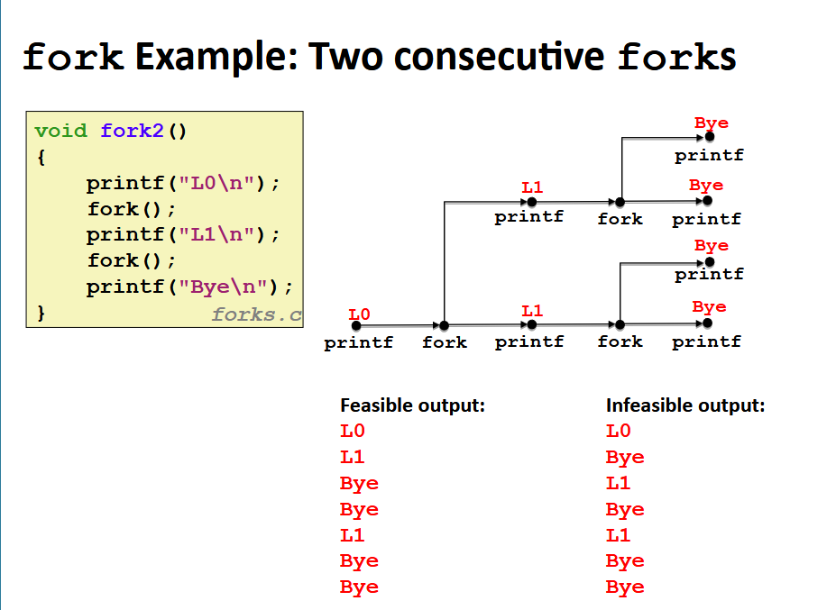
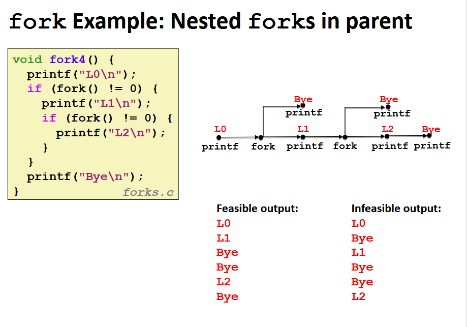
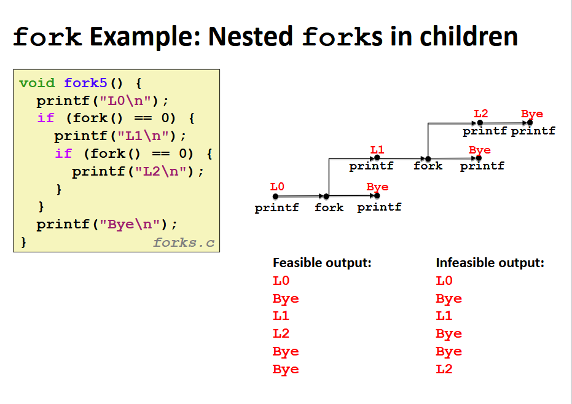

**Grzebanie procesów** - gdy proces się kończy, dalej zużywa zasoby, nazywany jest **zombie**. Grzebanie procesu jest wykonywane przez rodzica lub zakończone dziecko (`wait` albo `waitpid`), rodzic dostaje informację o exit statusie, jądro usuwa proces zombie. Jeśli rodzic nie pogrzebie dziecka, wtedy zrobi to proces `init` o PID == 1.

Przykłady:
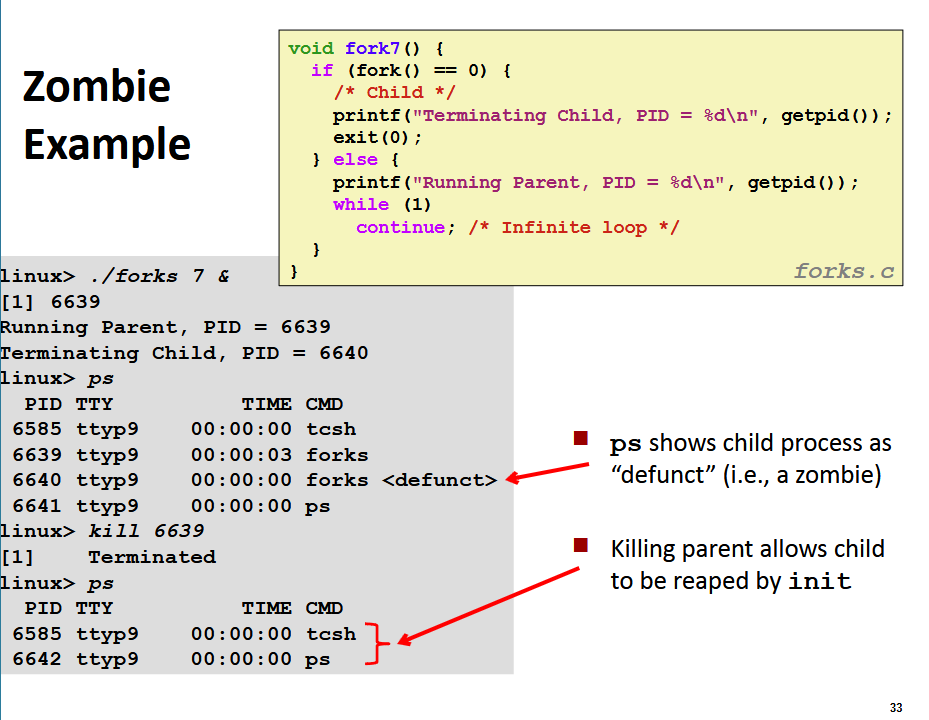
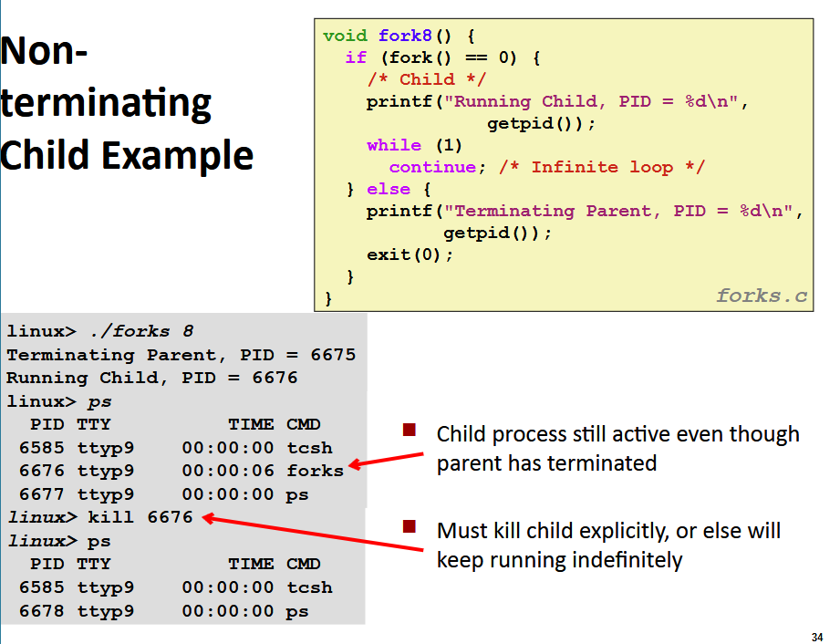

```c
int wait (int *child_status)
```
Zawiesza obecny proces dopóki jedno z jego dzieci się nie skończy, implementowany jako wywołanie systemowe (syscall)
Rodzic grzebie dziecko za pomocą `wait`. Wartość zwracana to pid procesu dziecka, który się zakończył. Jeśli child_status != NULL, wtedy int na którego wskazuje będzie ustawiony na wartość wskazującą powód zakończenia i exit status.

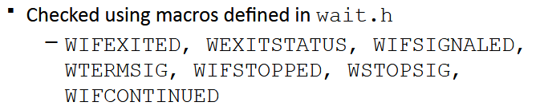

Przykłady:
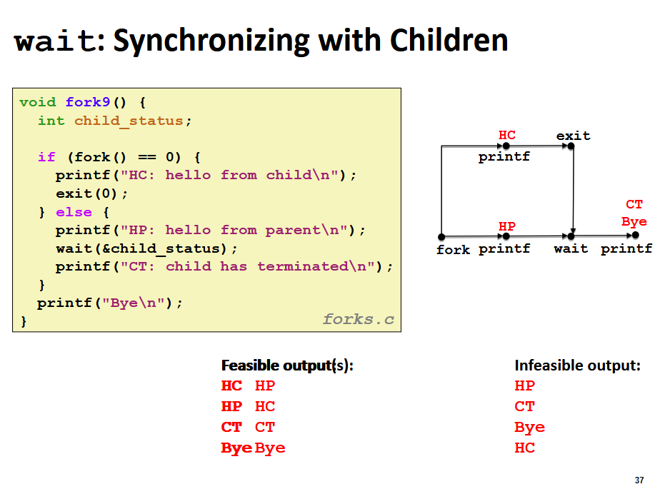
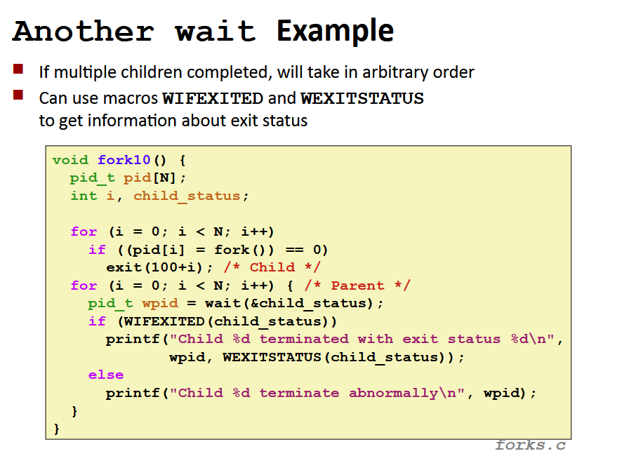

```c
pid_t waitpid(pid_t pid, int *status, int options)
```
Zawiesza działanie obecnego procesu, dopóki konkretny proces się nie skończy.

Przykład:
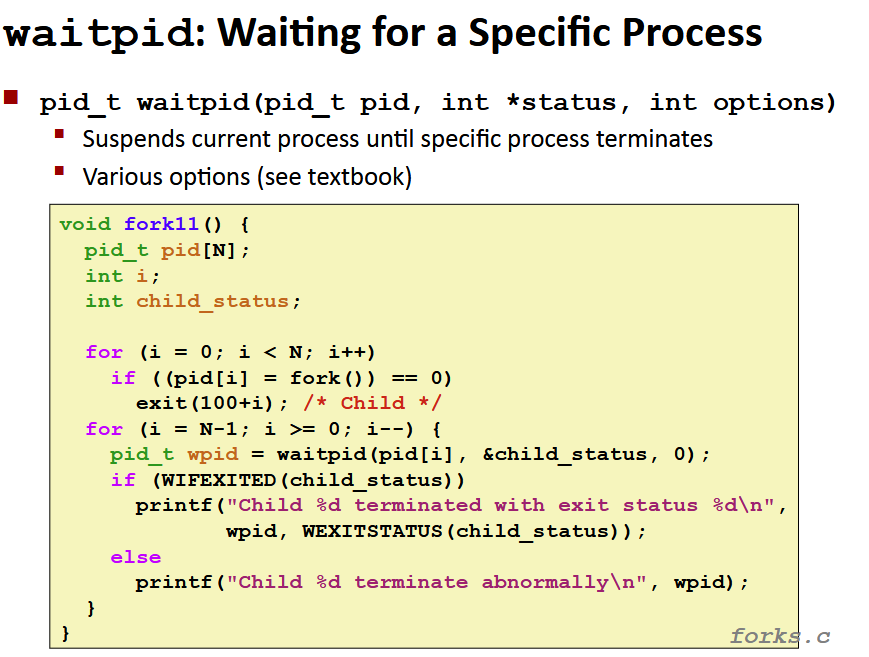

```c
int execve(char *filename, char *argv[], char *envp[])
```
Ładuje i uruchamia aktualny proces:
- filename - nazwa .exe, który jest uruchamiany,
- argv - lista argumentów, konwencja: argv[0] == filename,
- envp - lista zmiennych środowiskowych
Nadpisuje kod, dane i stos, zachowuje PID, otwarte pliki i kontekst sygnałów, wołany raz nigdy nie wraca (chyba, że error)

Przykład:
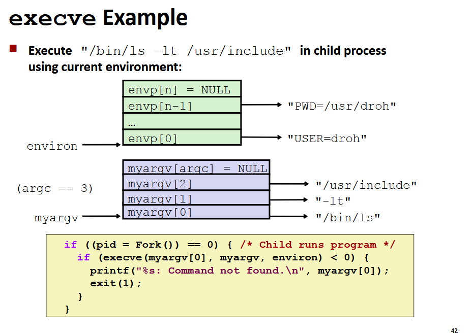

Procedury z listy 0:

```c
int open(const char *pathname, int flags, /* mode_t mode */)
```
Otwiera plik z `pathname`, jeśli nie istnieje, może być stworzony (musi być flaga O_CREAT). Wartość zwracana to deskryptor pliku, mała nieujemna liczba, która jest indeksem w tabeli otwartych deskryptorów. Używamy go m.in. do `read`, `write`

```c
ssize_t read(int fd, void buf[.count], size_t count) 
```
Czyta ilość określoną w `count` bajtów z deskryptora `fd` do bufora zaczynającego się od `buf`. Jeśli zakończy się sukcesem zwraca ilość przeczytanych bajtów, kursor w pliku zostaje przesunięty o tą liczbę. Jeśli liczba zwrócona jest mniejsza niż liczba bajtów żądanych, to nie problem bo np. w pliku mogło być mniej danych, albo bo `read` było przerwane sygnałem.

```c
ssize_t write(int fd, const void buf[.count], size_t count) 
```
Pisze ilość określoną w `count` bajtów do bufora zaczynając od `buf` do pliku opisanego deskryptorem `fd`, podobnie numer bajtów może być mniejszy od żądanego. Tak samo przy sukcesie zwracana jest liczba bajtów, wpp -1, ponadto errno jest ustawione, żeby zasygnalizować przyczynę.

```c
off_t lseek(int fd, off_t offset, int whence)
```
Zmienia offset otwartego deskryptora pliku `fd` na `offset` wg dyrektywy `whence`:
- `SEEK_SET` - offset pliku jest ustawiany na `offset` bajtów,
- `SEEK_CUR` - offset pliku jest ustawiany na jego dotychczasową lokalizację + `offset`,
- `SEEK_END` - offset pliku jest ustawiony na rozmiar pliku + `offset`