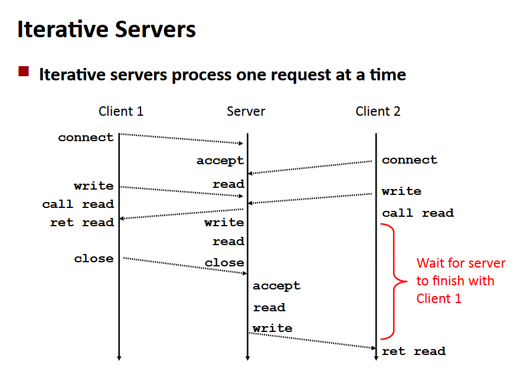

# Programowanie współbieżne

Standardowe problemy związane z programowaniem współbieżnym:
- wyścig - wynik zależy od kolejności decyzji,
- deadlock - niepoprawny przydział danych uniemożliwia postęp,
- głodzenie - zewnętrzne zdarzenia mogą zatrzymać bieg procesu będącego częścią większego zadania

Czemu printf potrzebuje locków? Żeby uzyskać dostęp do współdzielonych buforów.

Podejścia do pisania współbieżnych serwerów:
- oparte na procesach:
    - jądro automatycznie przeplata przepływy,
    - każdy przepływ ma swoją prywatną przestrzeń adresową,
- oparte na zdarzeniach:
    - programista manualnie przeplata,
    - wszystkie przepływy dzielą tą samą przestrzeń adresową,
- oparte na wątkach:
    - jądro automatycznie przeplata przepływy,
    - każdy przepływ ma tą samą przestrzeń adresową,
    - hybryda między dwoma powyższymi

SEND WELP TRUDNE!!!