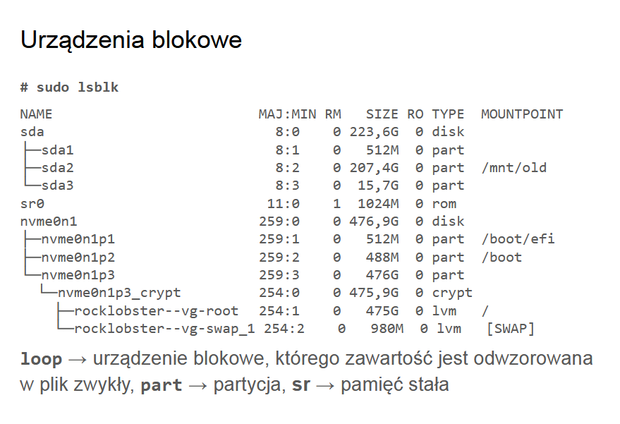
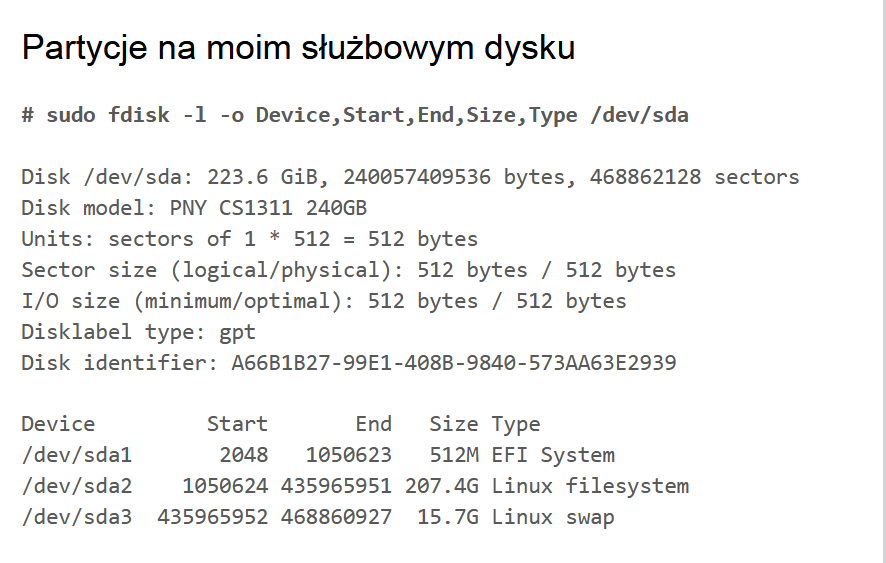
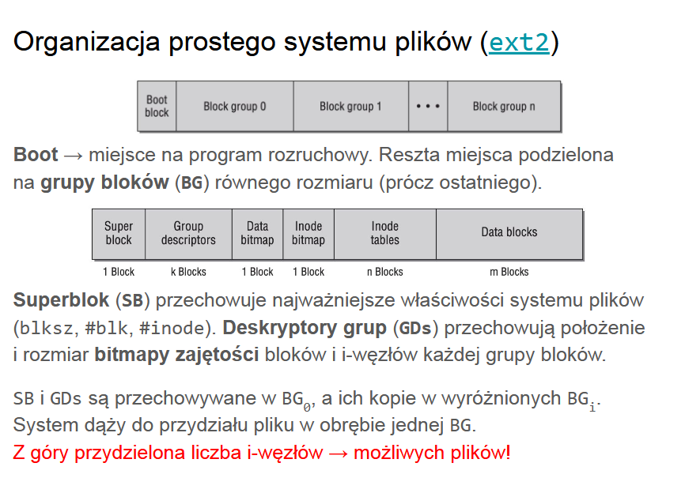
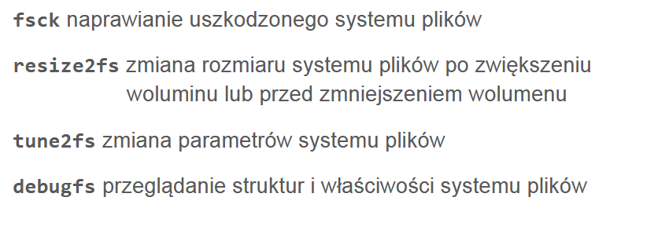

# Systemy plików

Czym zarządzają systemy plików? Pamięcią, z reguły zewnętrzną. Jednostką adresowania jest **sektor** (z reguły 512-bajtowy), dawniej adresowanie fizyczne używające **geometrii dysku (CHS)**. Dziś **liniowe adresowanie (LBA)**, czyli adresy logiczne tłumaczone na fizyczne przez kontroler dysku.

System uniksowy dostarcza abstrakcji nad pamięcią zewnętrzną w postaci **urządzeń blokowych**, czyli plików o swobodnym dostępie.

Dysk jest podzielony na **woluminy/partycje**. **Tablica partycji (GPT)** - dyskowa struktura danych przechowująca opis partycji. Na dysku mamy 2 kopie tablicy partycji, dla każdego wpisu sumy kontrolne. 

Jak sobie radzić z fragmentacją systemu plików? 
- pozostawienie miejsca za ostatnim blokiem zapobiega powstaniu fragmentów przy dopisywaniu na koniec pliku,
- **odroczony przydział bloków** na k sekund - grupujemy w pamięci zapisy wymagające przydziału nowych bloków w nadziei na zmniejszenie ogólnej liczby fragmentów,
- **usługa defragmentacji** - narzędzie użytkownika lub wątek jądra.

A jak wewnętrzną?
- **upakowywanie ogonów** - końcówki kilku plików pakujemy do jednego bloku, jeśli pliki już nie rosną,
- umieszczanie zawartości bardzo krótkich plików w miejscu wskaźników inode.

