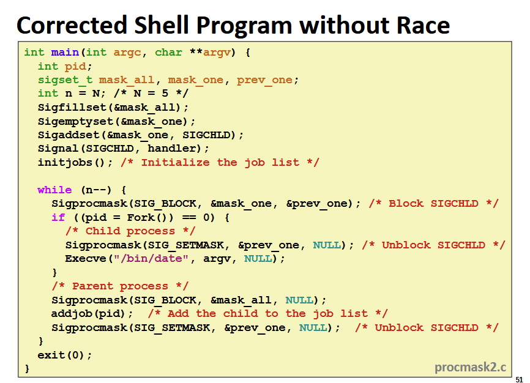
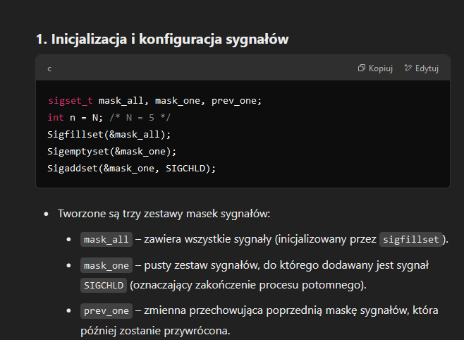
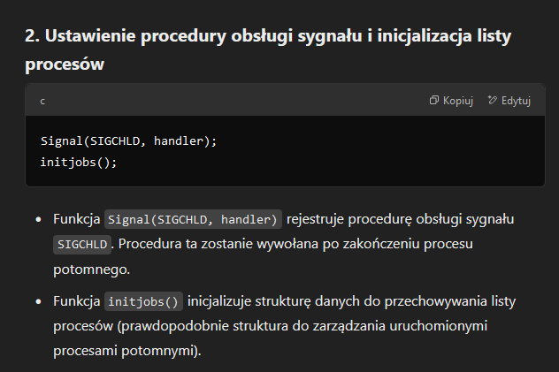
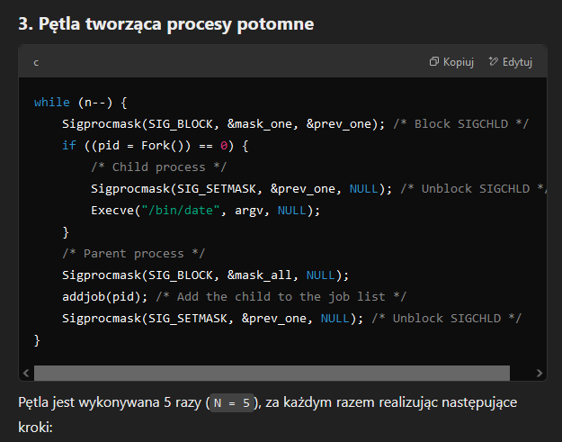
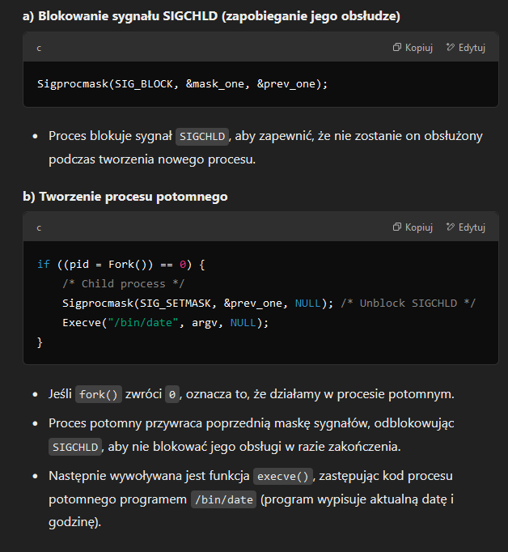
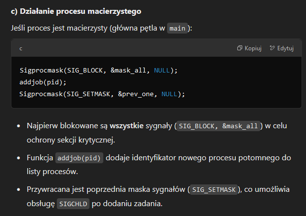

# Sygnały

UWAGA! Sygnały są handlowane w kodzie użytkownika, nie jądra!

**Shell** - program, który uruchamia programy za pomocą komend od użytkownika. W shellu background jobs po zakończeniu stają się zombie, nie będą pogrzebane bo shell się nie zakończy, powstanie wyciek pamięci, który może skończyć pamięć w jądrze.

**Sygnał** - wiadomość, która powiadamia proces, że jakieś istotne zdarzenie miało/ma miejsce w systemie, podobne do wyjątków i przerwań, wysyłane z jądra do procesu, definiowane przez małe inty będące ID, jedyna informacja w sygnale to jego ID i fakt, że został wysłany.

Popularne sygnały:
- 2 (SIGINT) - terminate, ctrl+c,
- 9 (SIGKILL) - terminate, kill program,
- 11 (SIGSEGV) - terminate, segfault,
- 14 (SIGALRM) - terminate, sygbał timera,
- 17 (SIGCHLD) - ignore, dziecko zatrzymane lub zakończone

Jądro wysyła sygnał do procesu poprzez aktualizację kontekstu tego procesu. Wysyła z jednego z powodów:
- wykryte zostało zdarzenie takie jak dzielenie przez zero (SIGFPE) albo zakończenie procesu dziecka (SIGCHLD),
- inny proces wydał komendę `kill`, żeby jawnie zażądać od jądra wysłanie tego sygnału do procesu docelowego,

Proces docelowy otrzymuje sygnał, gdy jądro zmusza go, żeby w jakiś sposób zareagował na dostarczenie sygnału. Sposoby reakcji to:
- ignore, nie robimy nic,
- terminate, 
- catch, poprzez wywołanie funkcji (handlera) z poziomu użytkownika, podobne do wyjątku systemowego

Sygnał jest **oczekujący**, jeśli został wysłany ale jeszcze nie dostarczony, może być tylko jeden oczekujący sygnał danego typu, sygnały nie są kolejkowane, kolejne tego samego typu są discardowane. Proces może **zablokować** odbiór konkretnych sygnałów, zablokowane sygnały mogą być dostarczone, ale nie odebrane do momentu odblokowania. Oczekujący sygnał może być odebrany maksymalnie raz.

Jądro trzyma wektory bitów pending i blocked dla każdego procesu, pending reprezentuje zbiór oczekujących sygnałów, ustawia k-ty bit pending gdy sygnał k został dostarczony, czyści k-ty bit pending, gdy sygnał k został odebrany. Podobnie blocked, może być ustawiony i wyczyszczony za pomocą funkcji `sigprocmask`, inaczej nazywany maską sygnałów.

Funkcje (potem z sygnaturami i dokładniej):
- `getpgrp()` - zwraca grupę procesów danego procesu,
- `setpgid()` - zmienia grupę procesów danego procesu

Polecenia: 
- `kill -9 24818` - zabija proces o ID 24818,
- `kill -9 -24817` - zabija wszystkie procesy z grupy o ID 24817

SIGINT - terminate, SIGSTP - suspend

```c
int setpgid(pid_t pid, pid_t pgid)
```
Ustawia grupę procesu `pid` na `pgid`.

```c
pid_t getpgrp()
```
Zwraca grupę procesów danego procesu.

```c
int setpgrp(void)
```
Ustawia grupę procesów danego procesu. On i `setpgid` zwracają 0 przy sukcesie, -1 przy errorze, dlatego int.

POĆWICZYĆ SIGPROCMASK PRZY ZADANIACH Z TEJ LISTY, BO NIE MA SENSOWNYCH DEFINICJI!!!

Przykłady handlerów:





