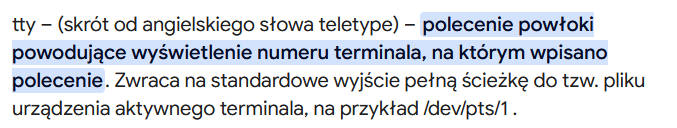
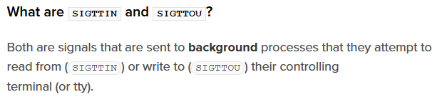

# Terminal

**Zadanie** - grupa procesów uruchomiona w wyniku wpisania polecenia. Polecenie może łączyć procesy potokiem `|` i będą one wtedy wykonywane współbieżnie. Polecenia oddzielone średnikiem będą uruchamiane jako ciąg, jedno po drugim, kod wyjścia ostatniego procesu w potoku/ciągu będzie kodem wyjścia zadania.

Jeśli w poleceniu wystąpi znak `&`, to zadanie uruchomi się w grupie drugoplanowej. Wszystkie zadania drugoplanowe można wypisać poleceniem powłoki `jobs`. Wbudowane polecenie powłoki (np. `kill`) rozpoznają ciąg znaków %n jako zadanie o identyfikatorze n. Zadanie wstrzymane znakiem CTRL+Z można kontynuować w tle (`bg`) lub przenieść do grupy pierwszoplanowej (`fg`).

Co wiemy o pliku terminala?
- urządzenie znakowe do odczytu i zapisu,
- obsługiwane przez sterownik znajdujący się w jądrze,
- buforuje wejście od użytkownika wierszami i umożliwia edycję,
- po ENTER wysyła wiersz do procesu,
- do grupy pierwszoplanowej wysyła sygnał CTRL+C (SIGINT), CTRL+/ (SIGQUIT), a do drugoplanowej CTRL+Z (SIGTSTP, terminal stop),
CTRL+D wysyła znacznik końca pliku, ale go nie zamyka.

Komenda wyświetlająca właściwości urządzenia terminala: `stty -a`

**Tryb kanoniczny terminala** - udostępnia edycję wiersza, interpretuje znaki specjalne i wypisuje na ekran znaki wpisane przez użytkownika.

**Sesja** - pewna liczba grup procesów podłączonych do tego samego terminala sterującego.

**Terminal sterujący** - może należeć do co najwyżej jednej sesji, można wyświetlić bieżący za pomocą `tty`.

**Lider sesji** - zazwyczaj proces powłoki, żeby zostać liderem trzeba utworzyć sesję `setsid` i ustalić terminal sterujący `tcsetsid`, jeśli powłoka zostanie odłączona od terminala, to dostanie `SIGHUP` i zdecyduje, co zrobić z procesami, którymi zarządza.

`tcsetpgrp` - ustalenie pierwszoplanowej grupy procesów.

`waitpid` służy nie tylko do oczekiwania na zakończenie procesu potomnego, ale też do obserwowaniazmian stanu procesów potomnych przy pomocy flag `WSTOPPED` i `WCONTINUED`.

