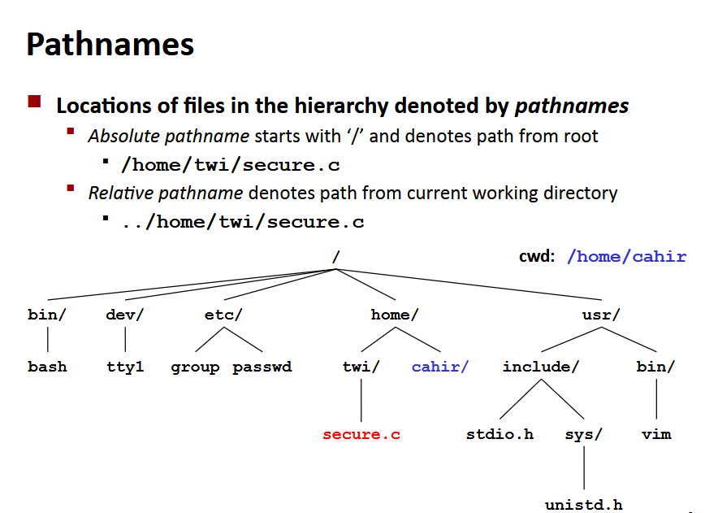
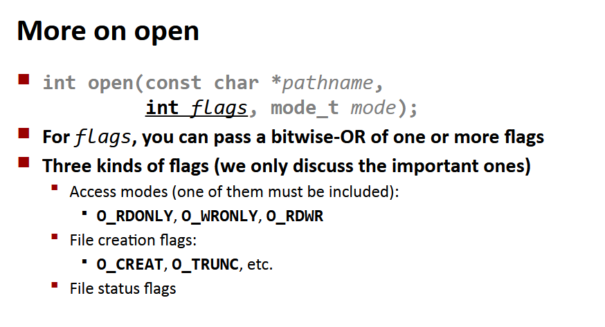

# Pliki

**Plik** - w linuxie to ciąg m bajtów b0,b1,...bm-1, wszystkie urządzenia I/O są reprezentowane jako pliki, nawet kernel.

Co można robić z plikami:
- otwierać i zamykać,
- czytać i pisać,
- zmieniać pozycję w pliku (`lseek`), czyli ustawiać offset do pisania lub czytania

Typy plików:
- zwykły plik,
- katalog,
- rura,
- gniazdo,
- link symboliczny,
- urządzenie blokowe/znakowe

**Zwykłe pliki** -  zawierają arbitralne dane, dzielimy je na tekstowe i binarne. Tekstowe zawierają jedynie znaki ASCII albo unicode, binarne zawierają wszystko inne (np. zdjęcia, obiekty). Plik tekstowy to ciąg linii tekstu, kończonych znakiem `\n`. UWAGA! W linuxie mamy `\n`, czyli line feed (LF), a w windowsie `\r\n`, czyli powrót karetki + line feed (CRLF). 

**Katalogi** - zawierają tablicę linków, każdy mapuje nazwę pliku na plik. Każdy katalog zawiera co najmniej dwa wejścia: . - link na siebie, .. - link na katalog rodzica. Ważne komendy:
- `mkdir` - stwórz pusty katalog,
- `ls` - wyświetl zawartość katalogu,
- `rmdir` - usuń pusty katalog



**Otwieranie plików** - funkcja `open` zwraca deskryptor pliku fd, fd == -1 znaczy error. Każdy proces stworzony przez shella zaczyna z 3 otwartymi deskryptorami: 0 - stdin, 1 - stdout, 2 - stderr.

**Zamykanie plików** - informuje jądro o zakończeniu dostępu do pliku, tak jak otwieranie, zwrócenie < 0 oznacza error.

**Czytanie plików** - kopiowanie bajtów z konkretnej pozycji (offsetu) w pliku, a potem update pozycji. Zwraca ilość przeczytanych bajtów, < 0 oznacza error, **short count**, czyli przeczytanie mniej niż miejsca w buforze jest możliwe i nie jest errorem.

**Pisanie do plików** - kopiuje z pamięci do pliku odpowiednią ilość bajtów i przesuwa pozycję, errory podobnie jak w pisaniu.




**Metadane pliku**:


Ważna funkcja w przekierowaniu: `dup2`

```c
int dup(int oldfd, int newfd)
```
Daje referencję `newfd`, żeby wskazywał na ten sam plik co `oldfd`, skoro wskazują na to samo, to współdzielą offset i flagi statusu, `lseek` przesuwa offset w obu równocześnie. Jeśli `newfd` był wcześniej otwarty, to jest zamykany zanim zostanie użyty.

**Strumienie I/O** - tak są definiowane otwarte pliki, abstrakcja dla deskryptora i bufora w pamięci. Są 3 podstawowe: stdin, stdout, stderr.


Ważne funkcje z list:

```c
int openat(int dirfd, const char *pathname, int flags)
```
Otwiera plik za pomocą konkretnego deskryptora podanego w `dirfd`.

```c
int pipe(int pipefd[2])
```
Tworzy rurę, służącą do komunikacji między procesami. `pipefd` jest używane żeby zwrócić 2 deskryptory wskazujące na końce rury. `pipefd[0]` to read end, `pipefd[1]` to write end. Przy sukcesie zwracane jest 0, wpp -1 i ustawiany jest status errno.

