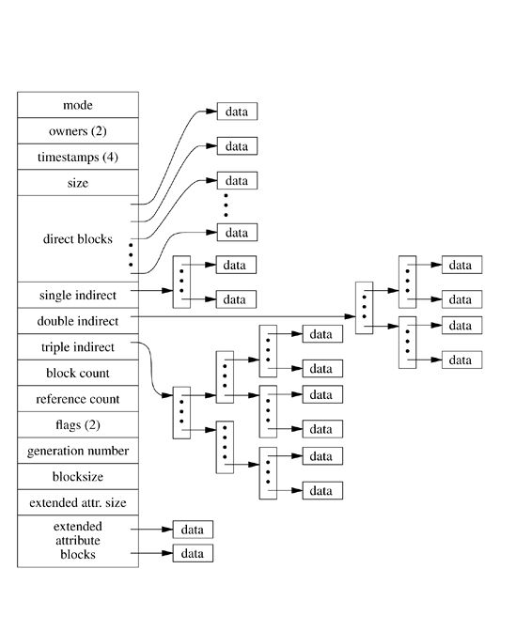
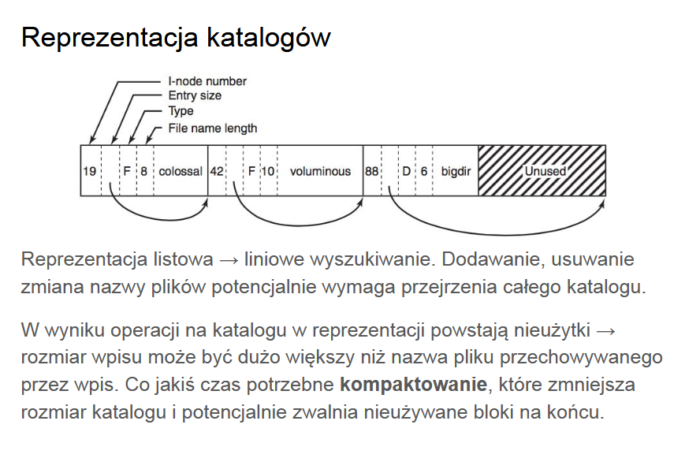
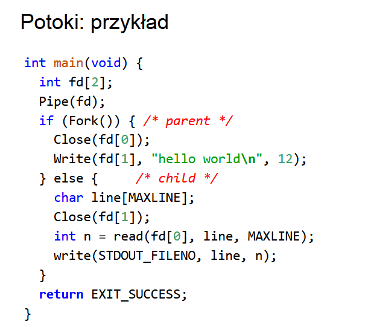

# Pliki (c.d.)

**i-node** - opis zasobu dyskowego, oprócz atrybutów zawiera wskaźniki na bloki danych i bloki pośrednie.




Przechodzenie ścieżki polega na tym, że system plików dysponuje tablicą wszystkich i-węzłów, zaczyna od katalogu głównego (inode == 2), jądro odczytuje dane katalogu i wyszukuje pary <nazwa, nr inode>.

**Dowiązania symboliczne** - specjalny typ pliku, który w zawartości przechowuje ścieżkę do innego pliku, nie sprawdza poprawności, więc może powstać pętla, działa jak słaba referencja.

**Dowiązania twarde** - wskaźniki na inode (licznik referencji) plików, różne nazwy tego samego pliku w obrębie jednego systemu.

**Rury** - jednokierunkowe (w linuxie) strumieniowe przesyłanie danych z buforowaniem w jądrze. Zachowują się przy odczycie jak zwykłe pliki, przy zapisie do długości zapisu write dopisuje atomowo.

Jakiś przykład:


Funkcja z ćwiczeń:
```c
int stat(const char *restrict pathname, struct stat *restrict statbuf)
```
Zwraca informację o pliku do bufora `statbuf`, musi być bit X, żeby to działało. `fstatat` to bardziej ogólny interfejs pozwalający na dostęp do informacji o pliku, różnicą jest obecność `dirfd` i flag jako argumentów.