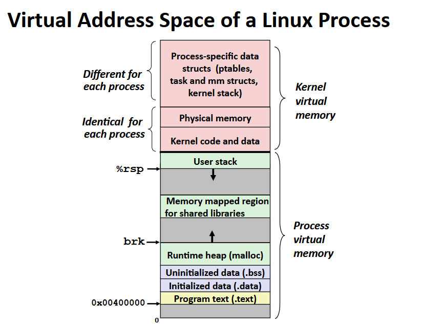
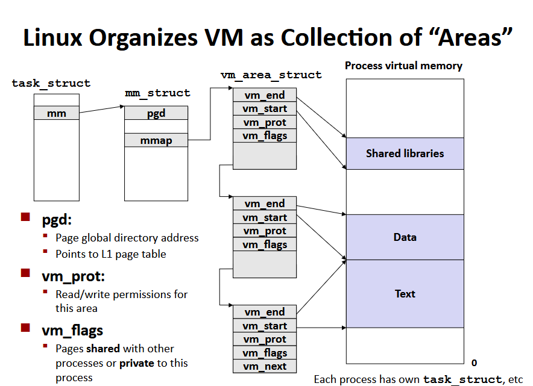
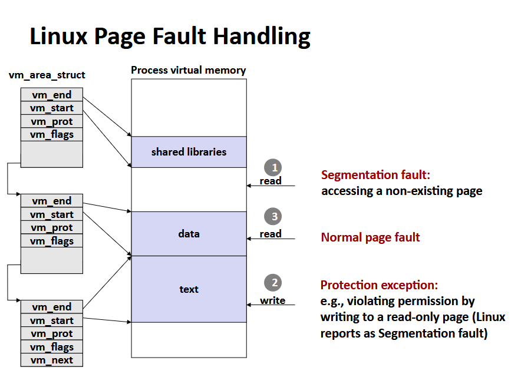
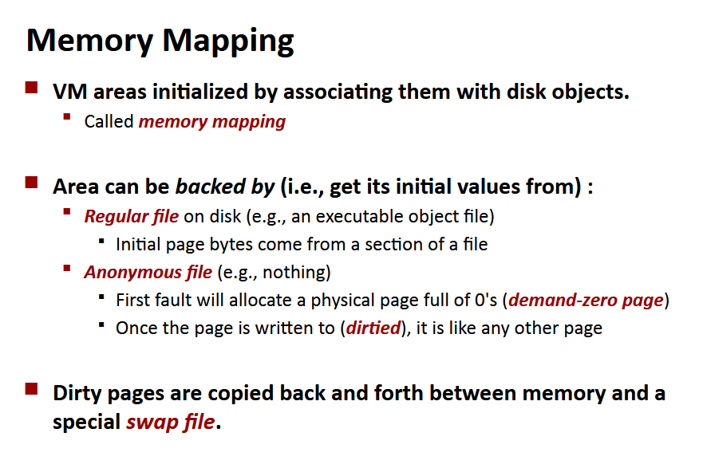
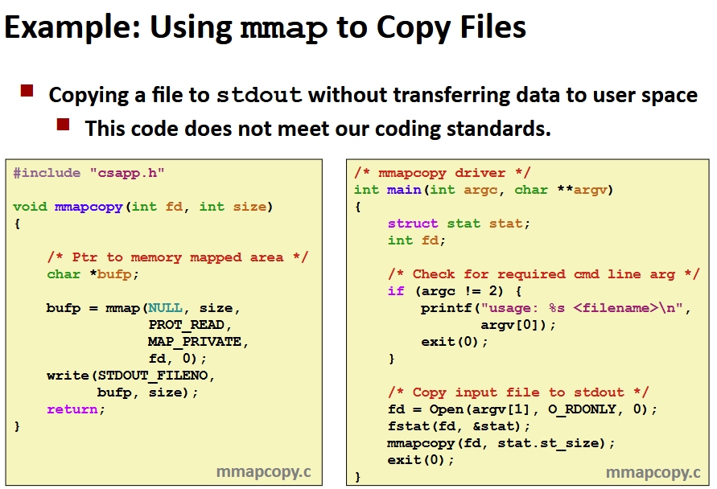

# Pamięć wirtualna






Przypomnienie: fork żeby stworzyć wirtualny adres dla nowego procesu:
- tworzy dokładne kopie `mm_struct`, `vm_area_struct` i tablicy stron,
- flaguje każdą stronę w obu procesach jako read-only,
- flaguje każde `vm_area_struct` w obu procesach jako prywatne COW (copy-on-write)

Przypomnienie: żeby uruchomić nowy program `a.out` w danym procesie używając execve:
- zwalniamy `vm_area_struct` i tablice stron ze starymi wejściami,
- tworzymy to samo dla nowych,
- ustawiamy PC na entry point w sekcji .text

Mapowanie pamięci z poziomu użytkownika:
```c
void *mmap(void *start, int len, int prot, int flags, int fd, int offset)
```
Mapuje `len` bajtów zaczynając od `offset` pliku określonego przez `fd`, na adresie `start`. Prot: PROT_READ/PROT_WRITE/PROT_EXEC, flags: MAP_ANON/MAP_PRIVATE/MAP_SHARED




