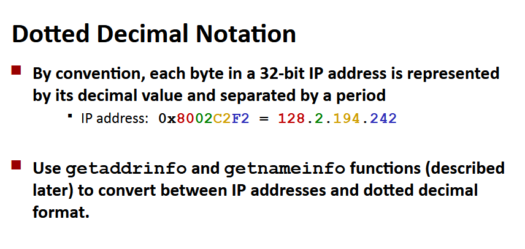

# Programowanie sieciowe

Większość aplikacji sieciowych jest bazowanych na modelu klient-serwer:
- proces serwera i jeden/wiele procesów klienta,
- serwer zarządza danymi,
- serwer zapewnia usługi manipulacji danymi przez klientów,
- serwer aktywowany przez request klienta

**Sieć komputerowa** - hierarchiczny system urządzeń i przewodów organizowany przez bliskość geograficzną. 

Co robi protokół internetowy:
- zapewnia schemat nazywania - definiuje format adresów hosta, każdy host i router ma przydzielony co najmniej jeden adres, który go jednoznacznie identyfikuje,
- zapewnia mechanizm dostarczania - protokół internetowy definiuje standardową jednostkę transferu (pakiet), składający się z headera (zawiera rozmiar pakietu, adres źródła i celu) i payloadu (zawiera dane wysyłane przez źródło)

Hosty są mapowane na zbiór 32-bitowych adresów IP (np. 128.2.203.179). Zbiór adresów IP jest mapowany na zbiór identyfikatorów zwanych nazwami domen (np. 128.2.217.3 jest mapowany na www.cs.cmu.edu).

**Domain Naming System (DNS)** - baza danych rozprzestrzeniona po świecie, w której internet trzyma mapowanie między IP a nazwami domen, można to sobie wyobrazić jako zbiór milionów wejść.

`nslookup localhost` zwraca adres domeny localhost. `hostname` zwraca prawdziwą nazwę domeny hosta lokalnego.

Właściwości mapowania DNS:'
- mapowanie 1-1 między domeną a IP,
- istnieje też przypadek wielu domen mapowanych na ten sam adres,
- wiele domen na wiele adresów,
- niektóre poprawne nazwy domen nie mapują się na żaden adres IP.

**Połączenia internetowe** - strumienie bajtów, przez które klienci komunikują się z serwerami, każde połączenie:
- łączy parę procesów,
- umożliwia przepływ danych w obu kierunkach równocześnie,
- strumień bajtów jest odbierany w takiej kolejności, w jakiej został wysłany.

**Gniazdo** - koniec połączenia, adres gniazda to para `IPaddress:port`.

**Port** - 16-bitowy int, który definiuje proces:
- port efemeryczny - przydzielany automatycznie przez jądro, gdy klient wyśle zapytanie o połączenie,
- well-known port - wiązany z usługami zapewnianymi przez serwer