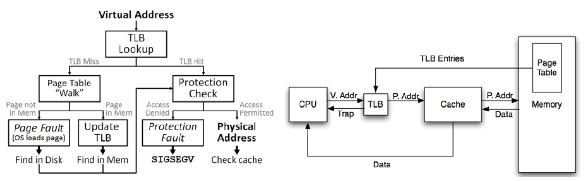

## Zad. 1
**Przerwanie sprzętowe** - stan sygnalizowany przez urządzenie zewnętrzne, jego wystąpienie oznacza, że urządzenie wymaga działania ze strony systemu operacyjnego lub programu wykonywanego przez procesor (zachodzi asynchronicznie do procesów w toku). Przykłady: 
- skrót klawiszowy, np. ctrl+c,
- kliknięcie/ruszenie myszką,
- podanie konkretnych danych na input

**Wyjątek** - w odróżnieniu od przerwania jest sygnalizowany przez oprogramowanie. Przykłady:
- dzielenie przez 0,
- niedozwolona operacja, 
- seg fault/page fault

**Pułapka** - zachodzi synchronicznie do programu, jest inicjalizowana przez użytkownika, a nie jak wcześniej, przez wykonywanie programu. Przykłady:
- breakpointy, 
- fork (stworzenie procesu),
- exit/execve

Wyjątek procesora nie oznacza błędu czasu wykonania programu, gdy jest obsługiwany przez program, a nie przez system operacyjny. 

Pułapka jest generowanaw wyniku prawidłowej pracy programu np. przy wykonywaniu syscalla.

## Zad. 2
Do **obsługi przerwań** wykorzystywany jest **wektor przerwań**, będący tablicą indeksów przerwań. Gdy występuje sygnał przerwania, procesor zatrzymuje dany proces i przerzuca się na inny. Wartości w wektorze wskazują na początek odpowiedniej **procedury obsługi przerwania**. Przed pobraniem pierwszej instrukcji procedury obsługi przerwania, system zapisuje potrzebne informacje (np. nr indeksu, żeby móc potem wznowić przerwany proces) i przełącza tryb działania. Gdy natrafimy na instrukcję powrotu z przerwania, przełączamy tryb z powrotem i wracamy do poprzedniego procesu poprzez indeks jego obsługi zapisany w wektorze. Procedury te powinny być wykonywane w **trybie jądra**, ponieważ pozwala on na dużo więcej działań w systemie niż tryb użytkownika, np. możemy czytać z pamięci lub do niej zapisywać. Należy korzystać ze stosu jądra, ponieważ stos użytkownika może należeć do innego procesu, przez co wartość stack pointera może być nieprawidłowa, co spowoduje problem przy zapisywaniu, z kolei w trybie jądra jest większa szansa, że wskaźnik będzie wskazywał na stronę dostępną w pamięci i będzie miał prawidłową wartość.

## Zad. 3 
**Sekcje** zawierają informacje potrzebne do linkowania, z kolei **segmenty** informacje wykorzystane w trakcie wykonywania. **Nagłówki** programu opisują segmenty, czyli jakie fragmenty pliku `ELF` mają być załadowane do pamięci, takie jak typ segmentu, offset, adres, rozmiar czy flagi dostępu. System operacyjny wie, pod jakim adresem umieścić segmenty programu, ponieważ korzysta z nagłówków programu, pierwsza instrukcja programu to pole entry point. 

## Zad. 4
- Przygotowanie przestrzeni adresowej dla nowego procesu polega na na załadowaniu odpowiednich segmentów programu w odpowiednie miejsca przydzielone przez jądro. Ponadto, jądro ustawia również stos wirtualny procesu. W momencie wywołania procedury _start na stosie muszą znajdować się `argc` i `argv`, wskaźniki do zmiennych środowiskowych i wektor pomocniczy. Jest to tablica klucz-wartość, która zawiera wiele informacji pomocniczych przekazywanych przez jądro do procesu, np. adres nagłówka programów, adres pierwszej instrukcji (entry point), rozmiar strony itd. 
- Funkcję jądra `syscall` należy wywołać poprzez umieszczenie odpowiednich danych w odpowiednich rejestrach. Wyników należy spodziewać się w rejestrze `%rax`, z kolei niepowodzenie wywołania systemowego sygnalizowane jest kodem błędu (z reguły liczbą ujemną).

## Zad. 5
Słowo kluczowe `volatile` mówi kompilatorowi, żeby nie optymalizował (np. podczas linkowania i relokacji) nic oznaczonego tym słowem. Przykłady użycia:
- kiedy funkcjonuje drugi wątek, który używa tej samej zmiennej/funkcji,
- kiedy wartość może być zmieniona przez zmianę stanu procesu.

## Zad. 6

W architekturze x86-64 mechanizm tłumaczenia adresów korzysta z czteropoziomowej hierarchii tablic stron:
- PML4 (Page Map Level 4) – najwyższy poziom tablicy stron,
- PDPT (Page Directory Pointer Table) – drugi poziom,
- PD (Page Directory) – trzeci poziom,
- PT (Page Table) – ostatni poziom, który wskazuje na rzeczywiste strony w pamięci fizycznej.

Adres wirtualny w systemach x86-64 ma długość 48 bitów (teoretycznie adresy mają 64 bity, ale tylko 48 bitów jest wykorzystywane), i jest podzielony na pięć pól:
- bity 47–39 – indeks do tablicy PML4.
- 38–30 – indeks do tablicy PDPT.
- 29–21 – indeks do tablicy PD.
- 20–12 – indeks do tablicy PT.
- 11–0 – offset wewnątrz strony.

**Pamięć TLB** służy do translacji adresów wirtualnych na fizyczne bez sięgania do tablicy stron, znajduje się wewnątrz MMU, a każda jej komórka zawiera informacje dotyczące jednej strony (index, offset).

## Zad. 7
**Wywołanie systemowe** to interfejs pomiędzy wykonywanym programem, a jądrem systemu operacyjnego. Funkcje systemowe wywoływane są przez specjalny mechanizm, wspierany przez dany procesor. Są to między innymi dostęp do systemu plików, komunikacja międzyprocesowa, uruchamianie innych programów, sterowanie urządzeniami systemowymi, obsługiwanie komunikacji sieciowej. Wywołanie systemowe `SYS_brk` powoduje zmianę wielkości sterty programu, dzięki temu zmieniana jest lokalizacja przerwania programu (koniec segmentu danych procesu). Zwiększenie wartości brk powoduje przydzielenie pamięci do procesu, a jej zmniejszenie zwalnia tę pamięć. Funkcje takie jak malloc, realloc, free niejawnie zmieniają wartość brk.