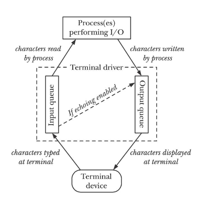
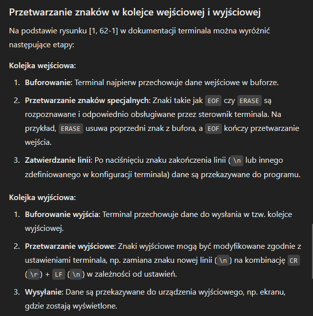

## Zad. 1

Definicje:

**Osierocony proces** - proces, którego rodzic już się zakończył, po zabiciu rodzica zostaje podpięty pod init (PID = 1).

**Zadanie drugoplanowe** - zadanie działające niezależnie od terminala, w trakcie jego wykonywania w tle możemy wykonywać inne komendy i zadania za pomocą tego samego terminala.

**Lider sesji** - jest nim przeważnie proces powłoki, proces którego id jest równe id sesji.

**Sesja** - zbiór powiązanych ze sobą grup procesów, mający swojego lidera.

**Terminal sterujący** - terminal, w którym zaczyna się proces w Linuxie, np. jeśli uruchamiamy komendę z shella, terminalem sterującym jest okienko terminala, z którego została uruchomiona.

Komendy:
```
xterm -e 'bash -i' - tworzy powłokę w nowej instancji emulatora terminala
sleep 1000 & - uruchamia proces sleep jako zadanie drugoplanowe
ps -eo pid,ppid,cmd | grep sleep - sprawdza, kto jest rodzicem sleep
kill -SIGKILL [id rodzica sleep] - zabija proces rodzica
ps -eo pid,ppid,cmd | grep sleep - sprawdza, kto jest rodzicem sleep po zabiciu powłoki 
ps -eo pid,ppid,cmd | grep [id rodzica] - sprawdza, jaki dokładnie jest to proces
```

## Zad. 2

**Tryb kanoniczny** - w tym trybie wejście w terminalu jednostką przetwarzania danych jest linia (znaków, tekstu). Linie są ograniczane przez znak `\n`, `EOF` albo `EOL`. Oznacza to, że nic nie zostanie zwrócone do momentu wpisania całej linii lub wysłania odpowiedniego sygnału. Ponadto, zawsze zwracana jest maksymalnie jedna linia, niezależnie od rozmiaru danych w requeście. 

 


Na czas wpisywania hasła przez użytkownika program powinien wyłączyć echo mode, żeby nie było widać wpisywanych znaków.

Edytory tekstu, takie jak vi, korzystają z trybu niekanonicznego, ponieważ muszą przetwarzać każdy pojedynczy znak zaraz po jego wprowadzeniu. 

**Tryb niekanoniczny** - w nim terminal nie buforuje pełnej linii, co pozwala na natychmiastową reakcję na wpisywanie przez użytkownika, znaki takie jak ctrl+d albo ctrl+c mogą być interpretowane w specjalny sposób przez edytor.

## Zad. 3

`stty -a`

Znaki, które sterownik terminala zamienia na sygnały związane z zarządzaniem zadaniami: 
- intr - generuje sygnał SIGINT, który jest wysyłany do wszystkich procesów pierwszoplanowych terminala sterującego,
- quit - generuje sygnał SIGQUIT, również wysyła do wszystkich procesów pierwszoplanowych,
- swtch - zmienia wersję powłoki,
- susp - generuje sygnał SIGSTP,
- start/stop - czasowo zatrzymują/wznawiają output

Znaki, które służą do edycji wiersza:
- erase - usuwa ostatni znak bieżącej linii,
- kill - usuwa całą linię,
- eof - gdy się pojawi, wszystko co zostało napisane zostaje przekazane do procesu bez czekania na `\n`,
- nl - znak `\n`,
- eol - dodatkowy ogranicznik linii, coś jak nl,
- eol2 - tak samo jak eol,
- werase - kasuje ostatnie słowo bieżącej linii,
- rprnt - sprawia, że bieżąca linia musi być wpisana ponownie,
- lnext - wprowadzenie następnego znaku ,,dosłownie", bez dodatkowych znaczeń,
- discard - odrzucenie danych z outputu terminala

Sygnał TERM służy do zmiany rozmiaru okna, nowy rozmiar wczytujemy procedurą `stty cols x rows y`.

## Zad. 4

https://en.wikipedia.org/wiki/ANSI_escape_code

```
echo -e "\033[A"; read - przesuwanie kursora w prawo
echo -e "\033[10C"; read - przesuwanie w górę
echo -e "\033[32mZielony tekst\033[0m"; read - zmiana koloru tekstu
```

Różnica w zachowaniu wynika z faktu, że powłoka (np. bash) pracuje w trybie niekanonicznym, co pozwala jej na natychmiastowe reagowanie na znaki klawiszy funkcyjnych i sterujących (strzałek, F1-F12, itp.). W tym trybie terminal nie czeka na zakończenie linii ani nie buforuje wejścia. Natomiast program `cat` działa w trybie kanonicznym, w którym terminal buforuje dane wejściowe i nie interpretuje sekwencji sterujących ani klawiszy funkcyjnych. Dlatego zamiast interpretować naciśnięcia klawiszy jako polecenia (jak robi to powłoka), cat po prostu wyświetla surowe sekwencje znaków wysyłane przez te klawisze.

## Zad. 5

1.  - sleep 1000
    - CTRL+Z (SIGSTP)
    - bg
2.  - find /
    - CTRL+S (STOP) i CTRL+Q (START), to znaki specjalne terminala, dlatego terminal na nie reaguje mimo, że nie dostaje sygnałów
3.  - cat - &, minus oznacza, że czeka na przyjęcie danych z terminala, ale skoro od razu przerzucamy to do backgroundu to dostaje sygnał SIGTTIN, w ten sposób utrzymuje się porządek wielozadaniowości
    - kill [pid]
4.  - cat /etc/shells &
    - stty tostop, po wpisaniu tego, sprawiliśmy, że procesy w tle nie mają prawa wypisywać rzeczy w terminalu
5.  - stty -echoctl
    - cat, po wpisaniu powyższego gdy klikamy znaki sterujące, np. strzałki, nie wyskakują surowe ciągi znaków mimo, że program dalej na nie reaguje, ponieważ kursor przesuwa się poprawnie