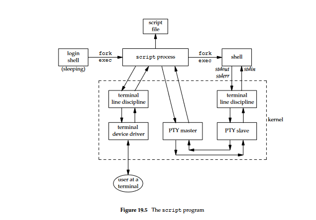
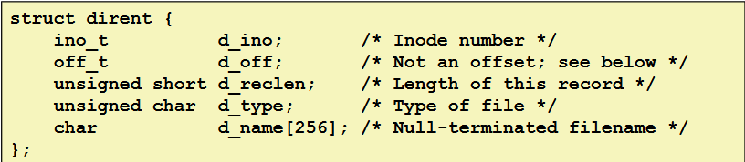

## Zad. 1

Co robi tty_curpos?\
Zapisuje bieżące ustawienia terminala (`tcgetattr`), następnie kopiuje termiosa do ts i ots. Potem wyłączane są flagi `ECHO`, `ICANON` i `CREAD`, te ustawienie wejdą w życie przy pomocy `tcsetattr` po opróżnieniu bufora wejściowego terminala. Następnie za pomocą `ioctl` sprawdza ile znaków czeka w kolejce wejściowej terminala, tworzy bufor (discarded), żeby wczytać i zignorować wszystkie znaki w kolejce.\
Wysyłany jest kod sterujący CPR, który poleca terminalowi zwrócenie bieżącej pozycji kursora, po czym odczytywana jest odpowiedź terminala do bufora.\
Na koniec przywracany jest tryb kanoniczny, a nowe ustawienia są utrwalane, tak samo zawartość kolejki wejściowej. Przywracane są ustawienia terminala zapisane w ots.

CPR - pozycja kursora

TCGETS - rozkaz służący do pobierania bieżących ustawień terminala, wykorzystywany przez funkcję `tcgetattr(3)`. Pozwala odczytać ustawienia takie jak szybkość transmisji, flagi kontroli, czy tryby pracy terminala.

TCSETSW - używany przez `tcsetattr(3)` do ustawiania nowych wartości parametrów terminala, które zostaną zastosowane dopiero po opróżnieniu buforów wyjściowych, co zapobiega przerwaniu aktualnie wyświetlanych danych. 

TIOCINQ - służy do uzuskania informacji o liczbie bajtów oczekujących w buforze wejściowym terminala. Może być używany do sprawdzenia, czy terminal posiada dane do odczytania.

TIOCSTI - pozwala włożyć znak do kolejki wejściowej terminala, co może być przydatne np. do automatycznego symulowania wejścia od użytkownika

ECHO - umożliwa wyświetlanie wpisanych przez użytkownika znaków na ekranie

ICANON - włącza tryb kanoniczny terminala

CREAD - włącza odbiór danych wejściowych przez terminal

## Zad. 2

`script(1)` - zapisuje do pliku kopię wszystkiego, co jest wpisywane i wypisywane w trakcie sesji terminala. 



Komendy potrzebne do zadania:
```
script -T timing -c dash
(jakieś komendy)
exit 42
scriptreplay -t timing
strace -f -e read,write -o script.log script -T timing -c dash
```

**Pseudoterminal** - urządzenie mające funkcje fizycznego termniala, ale nie jest terminalem xd

ICRNL - map CR to NL input\
ONLCR - map CR to NL output

## Zad. 3

Komendy:
```
strace -o pipeline.log
ps -ef | grep sh | wc -l > cnt
gedit pipeline.log
```

Kolejność i wyjaśnienie wywołań systemowych:
- pipe - tworzy rury przed klonowaniem procesów,
- clone - klonuje procesy do wykonania poszczególnych poleceń (w tym przypadku ps, grep i wc),
- dup2 - każdy proces konfiguruje przekierowania wyjścia i wejścia na odpowiednie końce rur lub do pliku,
- openat - otwiera plik do zapisu,
- close - zamyka zbędne końce rur,
- execve - uruchamia

## Zad. 4
Tworzy nową grupę procesów za pomocą `setpgid` po to, żeby proces ps nie miał pgid rodzica tylko swój własny, a nadaje niżej również za pomocą setpgid, w którym ustawia id procesów do zmiany na pgid ustawione wcześniej. 

`setpgid` jest wykonywane i dla procesu powłoki i dla potomnego, ponieważ jest to rodzaj zabezpieczenia przed nieodpowiednim przypisaniem pgid podczas wykonywania `fork`.

Powłoka używa wywołania `ioctl` (realizującego `tcsetpgrp`) do ustawienia grupy procesów pierwszoplanowych na nowo utworzony potok. Dzięki temu potok staje się grupą pierwszoplanową, co pozwala jej odbierać sygnały takie jak SIGINT (Ctrl+C) czy SIGTSTP (Ctrl+Z) bezpośrednio z terminala. Wywołanie to następuje po utworzeniu grupy procesów i przypisaniu do niej wszystkich procesów w potoku, aby upewnić się, że wszystkie są gotowe do przejęcia kontroli nad terminalem. Powłoka wyznacza kod wyjścia potoku na podstawie kodu wyjścia ostatniego procesu w potoku, ponieważ najczęściej wynik ostatniego polecenia determinuje wynik całego potoku.

## Zad. 5

Nie można czytać i modyfikować rekordów przy pomocy `read` i `write`, ponieważ nie mają one formy bajtów tylko rekordów/wskaźników, nie możemy odczytać tylko części z nich. 

**Rekord katalogu** - struktura składająca się z inode (id metadanych) i nazwy pliku, czyli jedynych potrzebnych informacji żeby dostać się do konkretnego pliku. Wczytać go można komendą `readdir`



Zawartość katalogu nie jest posortowana, ponieważ katalogi są implementowane jako tabele haszujące lub inne tego typu struktury, które nie zapamiętują kolejności posortowanej, lecz taką, w której pliki występują w katalogu. DEPENDS ON A FILE SYSTEM, źródło: trust me bro

**Dowiązanie** - referencja wskazująca na istniejącą zawartość pliku lub katalogu umieszczona w tym samym systemie plików. Dla systemu operacyjnego dowiązanie twarde jest dodatkową nazwą, której można użyć w celu odwołania się do zawartości danego obiektu. Plik z n dowiązaniami ma n+1 nazw. 

Skąd wynika liczba dowiązań? Każdy katalog ma co najmniej dwa, jedno na siebie (.) i jedno w katalogu nadrzędnym (/), dodatkowe dowiązania tworzą podkatalogi, każdy podkatalog zwiększa liczbę dowiązań głównego o jeden.

## Zad. 6

Wyścig w podanym kodzie będzie mieć miejsce między access() a open(), może bowiem dojść do sytuacji, kiedy inny proces między wywołaniami otworzy plik, przez co oba procesy otrzymają blokadę.

Poprawiony kod:
```c
#include "csapp.h"
bool f_lock(const char *path) {
    if (Open(path, O_CREAT|O_EXCL|O_WRONLY, 0700)) >= 0
        return true;
    return false;
}
```

Błąd TOCTTOU polega na sprawdzeniu stanu pliku w jednym momencie i wykonaniu akcji w oparciu o ten stan później, co prowadzi do niebezpieczeństw, ponieważ stan może się zmienić w trakcie.\
Zagrożenia z tego wynikające to naruszenie integralności danych i problemy z bezpieczeństwem. 

