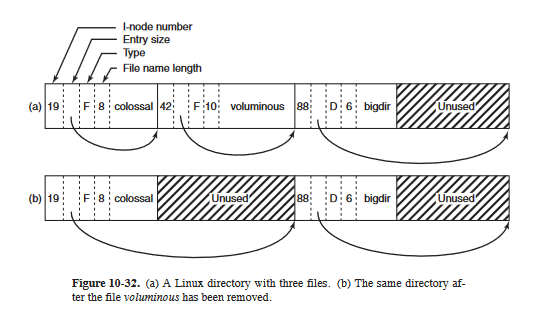

## Zad. 1

Jeśli bufor jest pusty:
- read będzie blokować do momentu, aż pojawią się dostępne dane,
- write wyśle SIGPIPE procesowi wołającemu

Jeśli bufor jest pełny:
- write blokuje się do momentu, aż odpowiednia ilość danych zostanie przeczytana, żeby móc dokończyć pisanie (w zależności od O_NONBLOCK),
- read zwróci EOF

Jeśli każdy z procesów pisze wiersze tekstu nie dłuższe niż PIPE_BUF, to znaki nie będą przemieszane (man 7 pipe)

ps ma skończony wydruk, po którym się kończy, grep dostaje EOF, drukuje wynik i również się kończy, tak samo działa wc, jeśli grep lub wc zakończy działanie przed ps, to ps otrzyma SIGPIPE i zakończy działanie.

**Short count** ma miejsce, gdy read przeczyta a write napisze mniej znaków, niż jest miejsca w buforze.

Jak połączyć rodzica i dziecko rurą utworzoną po uruchomieniu dziecka? "However, pipes can be used for communication between any two (or more) related processes, as long as the pipe was created by a common ancestor before the series of fork() calls that led to the existence of the processes."

## Zad. 2

Wywołanie systemowe `ioctl(2)` manipuluje parametrami plików specjalnych takich jak urządzenia blokowe, znakowe i rury.

Drugi i trzeci parametr ioctl:
- request - określa typ operacji, jaką chcemy wykonać, zazwyczaj łączy w sobie informacje o typie operacji, jej kodzie oraz rozmiarze danych.
- argp - wskaźnik na dodatkowe dane, które mogą być potrzebne do wykonania operacji, np. wskaźnik na strukturę danych

**DIOCEJECT** - wywołanie używane do wysunięcia nośnika z urządzenia (np. płyty),

**KIOCTYPE** - sprawdza typ terminala lub sesji, zwraca informacje o rodzaju urządzenia terminalowego,

**SIOCGIFCONF** - pobiera konfigurację interfejsów sieciowych, zwraca listę dostępnych interfejsów wraz z ich konfiguracjamin np. adresami IP.

## Zad. 3



Dodawanie pliku - przeglądamy katalog (liniowo), sprawdzamy czy plik już tam jest, jak nie to kompaktowanie,

Usuwanie pliku - to samo w sumie, jeśli przed lub po usuwanym pliku są nieużytki, to długość wpisu przesuwana jest na koniec nieużytków, zwiększa się record size, a do nazwy wpisywane jest `\0`,

**Nieużytek** - nieużywany fragment reprezentacji katalogu, rozmiar wpisu, po którym występuje nieużytek jest większy od nazwy pliku,

**Kompaktowanie** - operacja, któa zmniejsza rozmiar katalogu, usuwa się w niej nieużytki, robimy ją, gdy wiemy że w katalogu jest dużo nieużytków, które zajmują dużo miejsca

## Zad. 4

Komendy: 
```
ls -lia /
ls -lia /usr
ls -lia /usr/bin
ls -lia /usr/bin/cc
```

**Ścieżka bezwzględna** - jej nazwa zawsze rozpoczyna się od `/`, służy do śledzenia ścieżki z katalogu root,

**i-node** - identyfikator konkretnego fragmentu metadanych w systemie plików, każdy fragment tych metadanych opisuje plik, algorym zaczyna działanie od i-node = 2, bo taki ma root

Sterownik wie, gdzie na dysku znajduje się i-ty bajt pliku, ponieważ mamy wskaźniki na kolejne bloki danych, stąd łatwo odczytać

Nie możemy tworzyć dowiązań do plików znajdujących się w obrębie innych zamontowanych systemów, ponieważ każdy system ma własną tablicę i-node, więc numery plików mogłyby się pokrywać