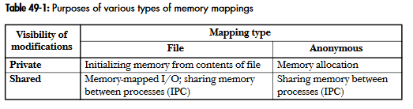
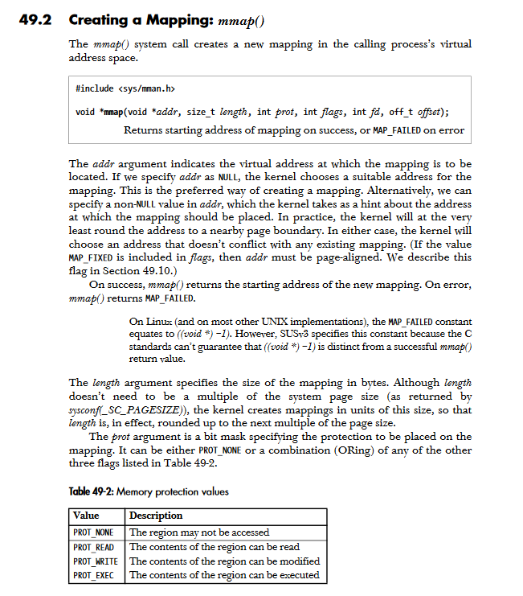
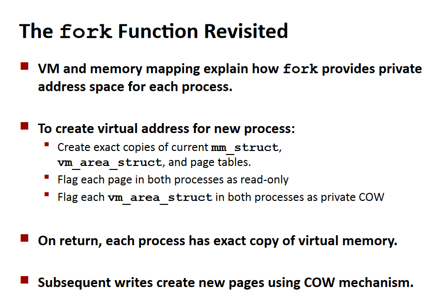
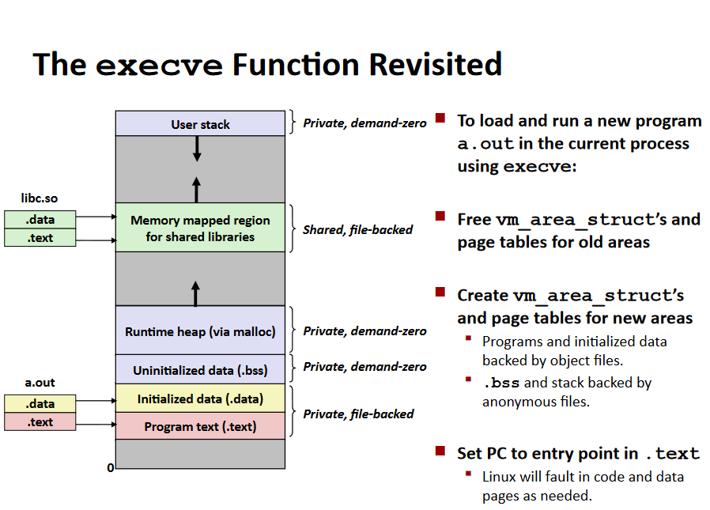
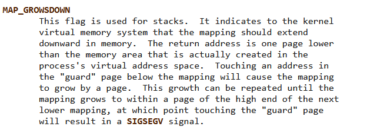
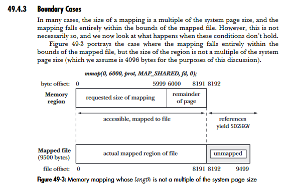
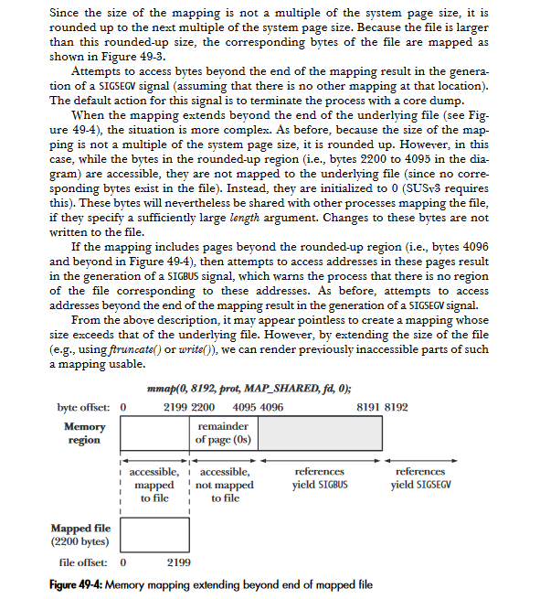
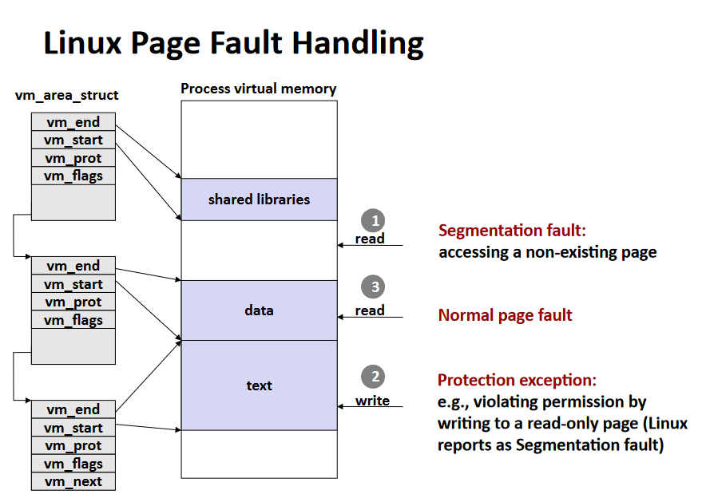

## Zad. 1

**Odwzorowanie plików w pamięć** - mapowanie fragmentu pliku prosto do pamięci wirtualnej wołającego procesu. Gdy plik został zmapowany, jego zawartość staje się dostępna dla operacji na bajtach w korespondującym fragmencie pamięci. Strony są automatycznie ładowane z pliku, gdy zajdzie taka potrzeba.

**Odwzorowanie pamięci anonimowej** - w tym przypadku nie ma korespondującego pliku, strony mapowania są inicjalizowane na 0.

**Odwzorowanie prywatne** - modyfikacje zawartości mapowania nie są widoczne dla innych procesów i nie są przenoszone do podporządkowanego pliku. Nie są też dostępne dla każdego innego procesu, mimo że na początku są dzielone. Jądro stosuje tu technikę copy-on-write. Polega ona na tym, że gdy proces chce zmodyfikować zawartość strony, jądro najpierw tworzy nową, osobną kopię strony przeznaczoną dla procesu, przez co zmiany będą widoczne tylko dla niego, na tej kopii.

**Odwzorowanie dzielone** - modyfikacje zawartości mapowania są widoczne dla innych procesów, które podlegają temu samemu mapowaniu i są przenoszone przez podporządkowany plik.

Pamięć obiektów odwzorowanych prywatnie może być współdzielona, póki nie trzeba nic modyfikować. Podczas modyfikacji tworzona jest kopia, w której pamięta się zmianę, jednak jest ona prywatna, niewidoczna dla innych procesów ani nie zapisywana w pliku.

Dla urządzeń blokowych pozwala to na oszczędzenie czasu przy wczytywaniu danych, które można wczytać naraz w dużym bloku pamięci. Pozwala to na komunikację między procesami, które nie są połączone pipem, bo nie są ściśle powiązane, ale korzystają z tej samej partycji dysku. Dla znakowych nie ma sensu, ponieważ dane dostajemy często małymi partiami, poszatkowane i w formie ciągłej. Chcąc być na bieżąco ze zmianami, odwzorowanie w pamięć nam przeszkadza.

## Zad. 2

Prywatne odwzorowanie pliku w pamięć - zawartość mapowania jest inicjalizowana z obszaru pliku. Wiele procesów mapujących ten sam plik na początku dzielą te same fizyczne strony pamięci, ale przez technikę copy-on-write zmiany w mapowaniu sprawiły, że mapowanie przez jeden proces jest niewidoczne dla innych. Zazwyczaj używa się tej metody żeby zainicjalizować obszar pamięci z zawartości pliku.

Prywatne odwzorowanie pamięci anonimowej - każde wywołanie `mmap` żeby stworzyć prywatne anonimowe mapowanie generuje nowe mapowanie różniące się od innych, stworzonych przez ten sam proces. Pomimo tego, że dziecko dziedziczy mapowania rodzica, copy-on-write sprawia, że po forku rodzic i dziecko nie widzą zmian w mapowaniu. Podstawowe zastosowanie tej metody to alokowanie nowej (wypełnionej zerami) pamięci dla procesu. 

Dzielone odwzorowanie pliku w pamięć - wszystkie procesy mapujące ten sam obszar pliku dzielą te same fizyczne strony pamięci, inicjalizowane z obszaru pliku. Modyfikacje zawartości mapowania są przekazywane do pliku. Taki typ mapowania pozwala na memory-mapped I/O, czyli ładowanie pliku do obszaru wirtualnej pamięci, której modyfikacje są automatycznie zapisywane do pliku.  

Dzielone odwzorowanie pamięci anonimowej - tak jak z prywatnym, każde wywołanie `mmap`, żeby stworzyć anonimowe mapowanie tworzy nowe, różniące się, które nie dzieli stron z żadnym innym. Różnica polega na tym, że tu nie stosuje się copy-on-write. Oznacza to, że kiedy dziecko odziedziczy mapowanie po forku, to rodzic i dziecko dzielą te same strony RAMu, a zmiany zawartości mapowania są widoczne dla innych procesów. 

## Zad. 3

Komenda: `cat /proc/$(pgrep X)/status | egrep 'Vm|Rss'`

Pola:
- VmPeak - maksymalna ilość pamięci wirtualnej, którą jakiś proces użył podczas wykonywania,
- VmSize - ilość całej pamięci wirtualnej używanej przez proces,
- VmLck - ilość zablokowanej pamięci przez proces,
- VmPin - strony, które nie mogą być przeniesione, ponieważ coś musi mieć dostęp do fizycznej pamięci,
- VmHWM - największa ilość RAM, jakiej proces użył podczas swojego istnienia,
- VmRSS - ilość pamięci fizycznej, która jest faktycznie w użyciu przez proces (kod i dane w RAM),
- RssAnon - ilość anonimowych stron pamięci (niezmapowanych na pliki),
- RssFile - ilość stron zmapowanych na pliki,
- RssShmem - ilość pamięci współdzielonej przez kilka procesów, 
- VmData, VmStk, VmExe - rozmiar .data, .text i stosu,
- VmLib - rozmiar dzielonego kodu bibliotek, 
- VmPTE - ilość rekordów pamięci fizycznej,
- VmSwap - ilość wymienionej wirtualnej pamięci przez anonimowe prywatne strony.

Różnica między zbiorem roboczym i rezydentnym procesu:

**Zbiór roboczy** - zestaw stron pamięci, których proces używa aktywnie w określonym czasie, podzbiór danych dostępnych w RAM, nie zawsze pokrywa się z rozmiarem rezydentnym.

**Zbiór rezydentny** - ogólna liczba ramek pamięci fizycznej przydzielonej procesowi, niezależnie od tego, czy są aktualnie używane.

_todo: skrypt w pythonie/sh_

Różnice między VmRSS a `vmstat -s` wynikają z tego, że VmRSS pomija pamięć współdzieloną procesów i nie uwzględnia pamięci jądra systemu, z kolei `vmstat` raportuje pełny obraz użycia pamięci, w tym cache systemowy, bufory I/O, pamięć jądra i pamięć współdzieloną.

## Zad. 4

W skrócie sprawdzamy, czy adres wirtualny znajduje się pomiędzy vm_start i vm_end jednej ze struktur, jeśli nie to segfault. Potem sprawdzamy, czy mamy uprawnienia do danej strony, jeśli nie to segfault z flagą protection exception. Strona nie jest załadowana do pamięci, zatem ładuje ją handler i po powrocie próbujemy ponownie przeczytać.

Informacje, które procesor musi dostarczyć: jaki adres wywołał błąd strony, jaka instrukcja wywołała błąd strony, ile bajtów ktoś próbował ściągnąć, uprawnienia itd.

**PGD** - pierwszy poziom mapowania pamięci na adres fizyczny.

**mmap** - zawiera listę vm_area_struct, która opisuje całą przestrzeń adresową programu.

MAPERR - przypadek 1 na zdjęciu, ACCERR - przypadek 2

**Pomniejsza usterka strony** - występuje, gdy strona jest załadowana do pamięci, ale nie jest oznaczona jako załadowana przez MMU. Taką stronę jądro musi oznaczyć jako załadowaną. Dochodzi do niej, gdy pamięć jest dzielona przez różne procesy i strona została już załadowana dla któregoś z procesów lub gdy została usunięta ze zbioru roboczego procesu.

**Poważna usterka strony** - występuje, gdy strona nie znajduje się w pamięci. Dzieje się tak dlatego, że system odracza ładowanie danych do pamięci do pierwszego dostępu, wtedy pojawia się ten błąd. 

**Bufor stron** - fragment RAM, którego zadaniem jest przyspieszenie odczytów i zapisów na dysku. Przy zapisach zmiany zostają dokonane jedynie w buforze stron, a zmienione strony są oznaczone bitem `dirty`.

## Zad. 5

`vm_prot` - prawa dostępu do pamięci, a dokładniej do read/write dla tego obszaru

`vm_flags` - dodatkowe flagi opisujące atrybuty obszaru pamięci, `VM_READ` mówi, że obszar może być odczytany, `VM_WRITE` mówi, że do obszaru możemy pisać, `VM_PRIVATE` mówi, że ten obszar jest odwzorowany prywatnie (copy-on-write).

Zmiany w pgd podczas
- pierwszego odczytu:
    - jeśli strona nie jest jeszcze w pamięci, jądro wygeneruje page fault,
    - utworzony zostanie nowy wpis w tablicy stron, który wskaże na odpowiednią ramkę w pamięci, prawa dostępu obejmują tylko read-only
- pierwszego zapisu:
    - wystąpi page fault z powodu próby zapisu do strony read-only,
    - copy-on-write przez jądro,
    - wpis aktualizowany tak, żeby wskazywał na nową ramkę, pojawi się prawo read-write

Po zawołaniu `fork` jądro stworzy dokładne kopie mm_struct, vm_area_struct oraz tablic stron, oflaguje każdą stronę w obu procesach (rodzicu i dziecku) jako read-only, a także oflaguje każde vm_area_struct jako prywatne COW. Kolejne wpisy stworzą nowe strony mechanizmem copy-on-write.

## Zad. 6

Mamy gwarancję, ponieważ przy odwzorowaniu prywatnym MAP_PRIVATE zmiany w pliku nie są widoczne w odwzorowaniu, każda modyfikacja strony jest obsługiwana w ramach copy-on-write. Odwzorowanie bazuje na stanie pliku w momencie tworzenia mapowania.

**Stronicowanie na żądanie** - sposób implementacji pamięci wirtualnej polegający na sprowadzaniu stron do pamięci operacyjnej tylko wtedy, kiedy jest ona potrzebna. Dzięki temu zmniejszamy liczbę operacji I/O oraz zapotrzebowanie na pamięć operacyjną, ponieważ nie sprowadzamy niepotrzebnych stron.

Gdybyśmy chcieli zrobić `open` na pliku wykonywalnym, który jest aktualnie uruchomiony, zwrócony zostałby błąd ETXTBSY (text file busy), tak samo przy `exec`. 
Gdyby system stosujący stronicowanie na żądanie pozwolił na modyfikację uruchomionego pliku wykonywalnego, to niepotrzebne na początku strony nie byłyby ładowane do pamięci. Po wykonaniu zmian, zostałyby wczytane strony po modyfikacji, co groziłoby kolizją i errorami.