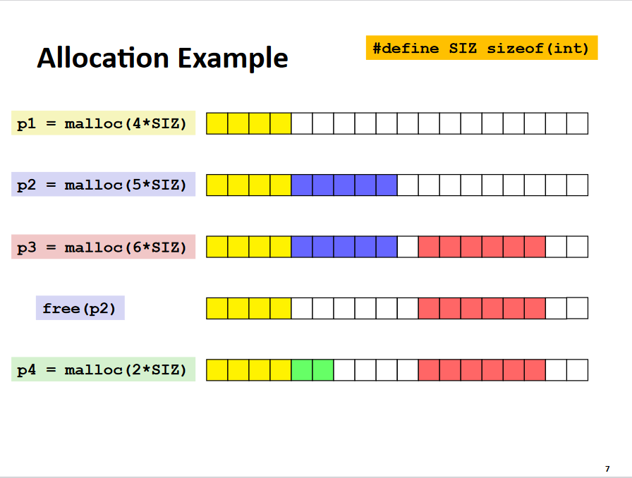
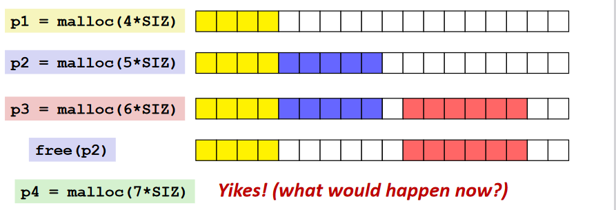
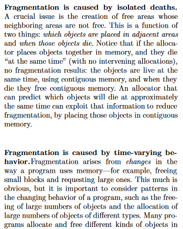
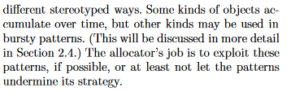
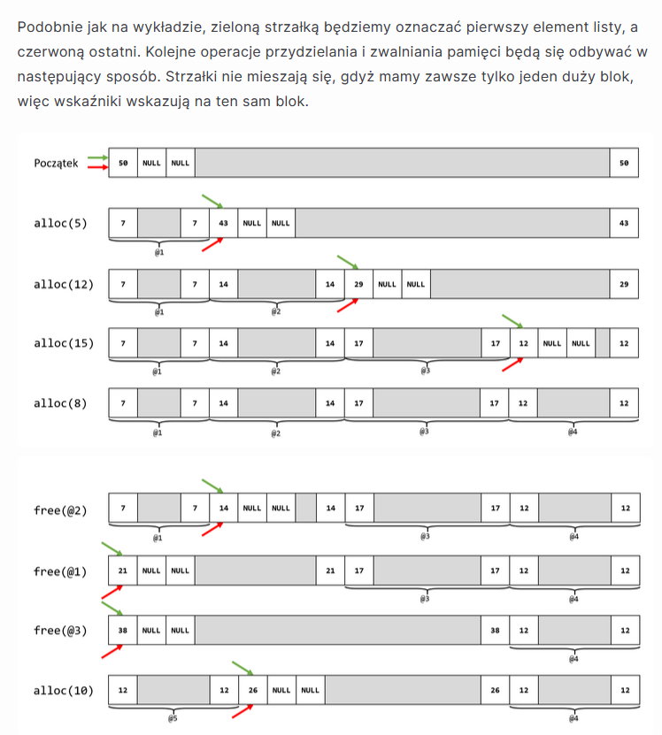

## Zad. 1

`sbrk` przesuwa koniec sterty, co jest nieoptymalne, ponieważ gdy zaalokujemy x bajtów, potem y bajtów, to mimo chęci zwolnienia pamięci x nie będziemy w stanie tego zrobić, ponieważ działa to podobnie do stosu, nie można zatem zdjąć czegoś, co nie jest na szczycie. Dlatego `malloc` używa `mmap` i `munmap`, gdy zaalokowana pamięć przestaje być potrzebna, zwalniamy ją `munmap`. Działa to tak, jak na zdjęciu z wykładu: 

## Zad. 2

**Fragmentacja wewnętrzna** - dotyczy niewykorzystania pamięci wewnątrz przydzielonego bloku, najczęściej jest skutkiem wykorzystywania przez system większych jednostek. Oznacza to, że pozostawiany jest niewykorzystany fragment przestrzeni adresowej, formalnie jest zajęty, lecz nie jest używany. 

**Fragmentacja zewnętrzna** - oznacza podział obszaru pamięci na rozłączne części, które nie stanowią ciągłości w przestrzeni adresowej. Występuje, gdy łączna suma wolnej pamięci nie jest wystarczająco duża do obsłużenia żądania alokacji, ale żaden z bloków nie jest dostatecznie duży i nie da się ich skonsolidować. Przykład na zdjęciu z wykładu: 

**Kompaktowanie** - proces konsolidacji pofragmentowanych danych (w tym przypadku alokowanej pamięci) w taki sposób, by były obok siebie. Pamięci przydzielonej przez `malloc` nie można kompaktować, bo wszystkie istniejące wskaźniki by się unieważniły. Możemy mieć wskaźnik do bloku, który chcemy przenieść, ale algorytm nie zapamiętuje tego w żaden sposób. 

## Zad. 3

Na podstawie paragrafu 2.4 widzimy trzy wzorce przydziału pamięci:
- ramps - gromadzi dane przyrostowo (podobnie do funkcji liniowej z wahaniami),
- peaks - gromadzi dane okresowo na użytke jakiejś fazy programu, potem zwalnia większość danych (szybkie skoki w górę i w dół),
- plateaus - gromadzi dane bardzo szybko na początku programu, a potem używa ich przez cały okres działania (prostokąt)

Zależność między czasem życia a rozmiarem polega na tym, że obiekty zaalokowane w tym samym czasie z dużym prawdopodobieństwem zostaną zwolnione w tym samym czasie, więc jeśli zostaną zaalokowane w ciągłym obszarze pamięci i jednocześnie zwolnione, to zmniejszone będą szanse na rozproszenie obiektów o długiej żywotności pośród tych o krótkiej.

## Zad. 4

## Zad. 5

**Algorytm kubełkowy** - polega na przechowywaniu list wolnych bloków tak, że każda lista przechowuje bloki o wyznaczonym rozmiarze, kiedy wykonywana jest alokacja, wybiera się blok z najmniejszej wystarczjącej listy. Operacja alokacji pamięci poleceniem `malloc` wybiera najmniejszy kubełek, gdy kubełek zawiera wolny blok, to przestaje on być wolny, oznaczamy go jako zajęty i zwracamy wskaźnik. W przypadku gdy kubełek jest zajęty, to szukamy bloku w kolejnym dostępnym kubełku, gdy z kolei wszystkie kubełki są zajęte, to alokowana jest nowa strona przeznaczona dla bloków o żądanym rozmiarze. Operacja `free` najpierw oznacza blok jako wolny, a gdy sąsiadujący również jest wolny, łączy je w jeden. Następnie cały wolny blok jest przenoszony do listy wolnych bloków. Operacja bierze pod uwagę, że ostatni element wskazuje na początek większego kubełka, wtedy przepinamy wskaźniki. 

Węzeł strażnik może znajdować się na początku każej listy w kubełku, dzięki temu lista ma co najmniej jeden element, co upraszcza implementację `malloc` i `free`. 

**Złączenie leniwe** - polega na łączeniu bloków dopiero w momencie, gdy chcemy kolejny raz zaalokować pamięć i nie napotkaliśmy bloku o wystarczająco dużym rozmiarze. Gdybyśmy chcieli leniwie złączać bloki, moglibyśmy zmniejszyć czas wyszukiwania bloków przy małych alokacjach, zwiększa to jednak fragmentację. 

