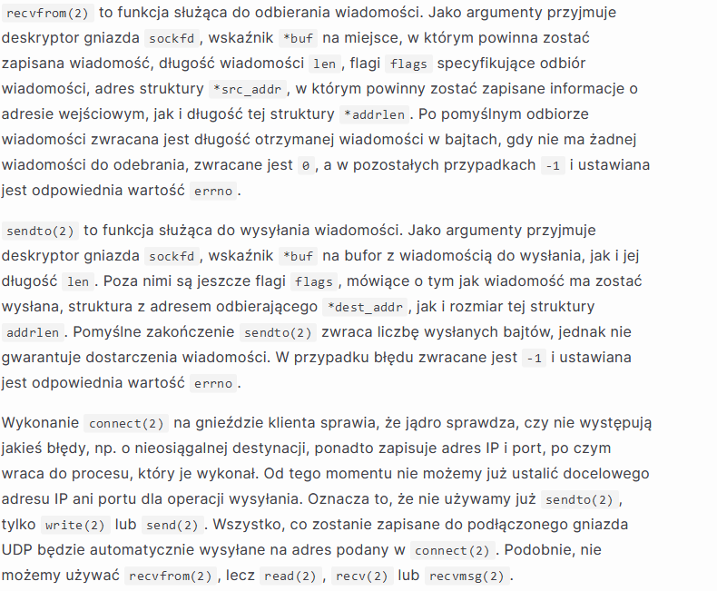

## Zad. 1

**Warstwa łącza** - odpowiada za komunikację między węzłami jednej sieci pomiędzy źródłem i celem. Aby przemieścić pakiet danych z jednego node do drugiego, sieć przekazuje datagram z danymi do warstwy łącza, która z kolei przekazuje go do kolejnego node na drodze. Przykładem protokołów należących do tej warstwy są Ethernet albo WiFi,

**Warstwa sieciowa** - odpowiada za przemieszczanie pakietów danych od jednego hosta do drugiego. Internetowy protokół warstwy sieciowej (TCP albo UDP) przekazuje segment i destination address do warstwy sieciowej, która zapewnia dostarczenie jej do warstwy sieciowej u hosta, który miał ją odebrać. Przykłady: IP

**Warstwa transportowa** - przekazuje wiadomości między endpointami. Przykłady: TCP, UDP.

**Kapsułkowanie** - dodawanie nagłówków przez kolejne warstwy protokołów (dane aplikacyjne, segment (transport), datagram (sieć), ramka(łącze)), w ten sposób dane są opakowane w odpowiednie formaty dla każdej warstwy.

Protokoły warstwy łącza i sieciowej nie są używane do komunikacji między procesami użytkownika, ponieważ działają na poziomie sprzętu i trasowania, korzystają z warstwy transportowej, która zapewnia identyfikację procesów przez porty.

## Zad. 2

**UDP** -  prosty, bezpołączeniowy protokół, jego zaletą jest niewielki narzut danych sterujących, dodawanych w procesie kapsułkowania. Bezpołączeniowość polega na tym, że przed rozpoczęciem komunikacji host źródłowy nie wysyła do docelowego żadnych informacji. 

**TCP** - protokół zapewniający połączenie między klientem i serwerem. TCP nawiązuje połączenie z serwerem, wymienia dane i kończy połączenie. Zapewnia on niezawodność, czyli gdy wysyła dane do odbiorcy, to wymaga potwierdzenia dostarczenia, a gdy go nie dostanie, ponownie wysyła dane i czeka dłuższy czas.

Półdupleksowa komunikacja - w jednym kierunku naraz (jak krótkofalówka), dupleksowa - w obu kierunkach jednocześnie (jak telefon)

TCP otrzymuje retransmisje po otrzymaniu ACK z flagą wskazującą brakujące dane, numeracja segmentów pozwala na odpowiednie składanie danych, zerwane połączenie wykrywane przez flagę FIN.

**Sterowanie przepływem** - w przypadku TCP dynamiczne dostosowanie rozmiaru okna przesyłania, żeby uniknąć przeciążeń. 

## Zad. 3

**Komunikacja klient-serwer** - to architektura systemu komputerowego umożliwiająca podział zadań/ról. Polega na ustaleniu, że serwer zapewnia usługi dla klientów zgłaszających do serwera żądania obsługi. 

**Gniazda strumieniowe** - gniazda oparte na połączeniach, umożliwiają sekwencyjny przepływ danych z gwarancją przesłania pakietu i zachowania kolejności. 

Działanie:
- serwer zostaje uruchomiony, tworzy gniazdo `socket`, wiąże je z nazwą (`bind`), zaczyna nasłuchiwać połączeń i je akceptować,
- klient zostaje uruchomiony, tworzy gniazdo, próbuje połączyć się z serwerem (`connect`), jeśli pomyślnie nawiąże połączenie, to gniazdo zostaje związane z adresem IP oraz unikalnym, lokalnym portem (efemerycznym/ulotnym).
- od wtedy klient może wysyłać żądania do serwera, który mu odpowie,
- po zamknięciu połączenia przez klienta, serwer dostaje informacje o EOF, po czym sam kończy działanie. 

**Port efemeryczny** - istnieje tylko podczas trwania połączenia, wykorzystuje go klient.

Drugi argument `listen` to backlog, opisujący maksymalną liczbę połączeń w kolejce dla deskryptora sockfd (1 argument).

Gniazdo przekazywane do `accept` jest związane z serwerem, a zwracane z klientem.

## Zad. 4

**Gniazda datagramowe** - gniazda bezpołączeniowe, każdy pakiet jest indywidualnie adresowany i przekierowywany. Nie ma gwarancji, że pakiet zostanie przesłany, ani że kolejność zostanie zachowana.

Działanie:
- klient wysyła datagram z żądaniem do serwera używając `sendto`,
- serwer blokuje `recvfrom` do momentu otrzymania datagramu od klienta, następnie żądanie jest odsyłane do klienta przez `sendto`,
- klient odbiera odpowiedź od serwera za pomocą `recvfrom`, po czym ponownie może wykonywać żądania.

Może rozpocząć działanie zaraz po `bind`, gdyż nie nawiązujemy tu żadnego połączenia, na które musimy czekać. 

Interfejs `read` i `write` jest niewystarczający, ponieważ w przypadku UDP należy odczytać adres, z którego przyszły pakiety, a następnie odesłać je do konkretnego adresu. 

## Zad. 5

`write` zwróci short count wtedy, gdy w buforze gniazda nie ma wystarczająco miejsca, czyli kernel nie mógł skopiować wszystkich danych. `read` zwróci short count, gdy w buforze nie ma miejsca na odczytanie wszystkich danych. Oba mogą też zwrócić short count, gdy spowodują je ograniczenia wewnętrznego buforowania lub duże opóźnienia sieci. 

Datagramy IP, UDP i TCP przechowują w nagłówku informację, jak dużo informacji jest w nich wysyłanych. Na podstawie tego można sprawdzić, czy datagram dotarł w całości czy ucięty. 

Jeśli klient będzie pisał do gniazda powiązanego z połączeniem, które serwer już zamknął, będzie kilkukrotnie automatycznie ponawiał próby wysłania segmentu. Jeśli serwer nie zostanie uruchomiony ponownie i wysłanie nie będzie mieć miejsca, zostanie zwrócony błąd. Jeśli nie było żadnych odpowiedzi od serwera, to będzie nim `ETIMEDOUT`, jeśli pośredni router ustalił, że serwer był nieosiągalny, to błędem będzie `EHOSTUNREACH` lub `ENETUNREACH`.

W kodzie funkcji open_listenfd użyto wywołania `setsockopt` (służy ono do ustawiania opcji gniazda) z flagą `SO_REUSEADDR`. Opcja ta służy do zezwolenia na ponowne użycie adresu przez inny proces, bez konieczności oczekiwania na jego zwolnienie. Gdyby flaga ta nie była ustawiona, oczekiwanie na zwolnienie adresu mogłoby trwać nawet kilkadziesiąt sekund.