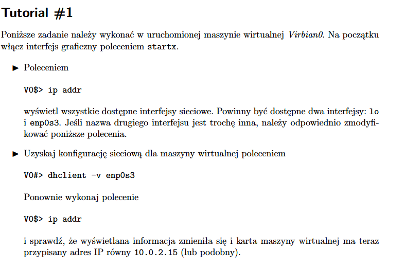
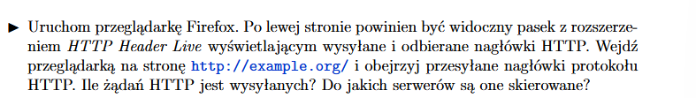
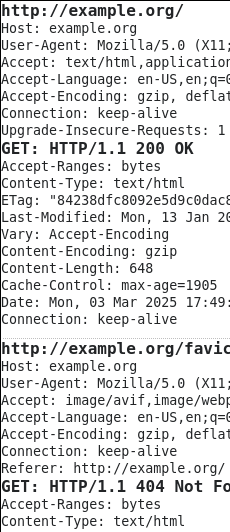
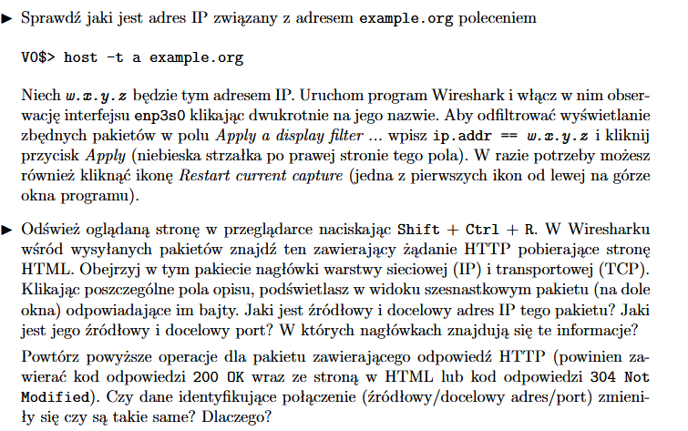
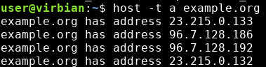
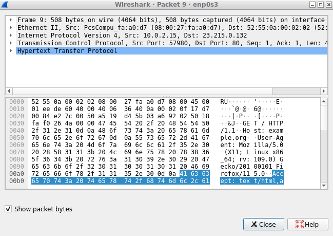
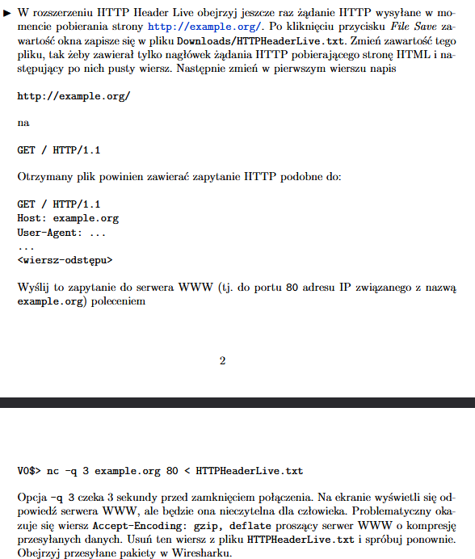
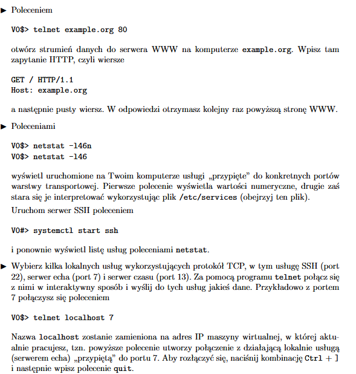
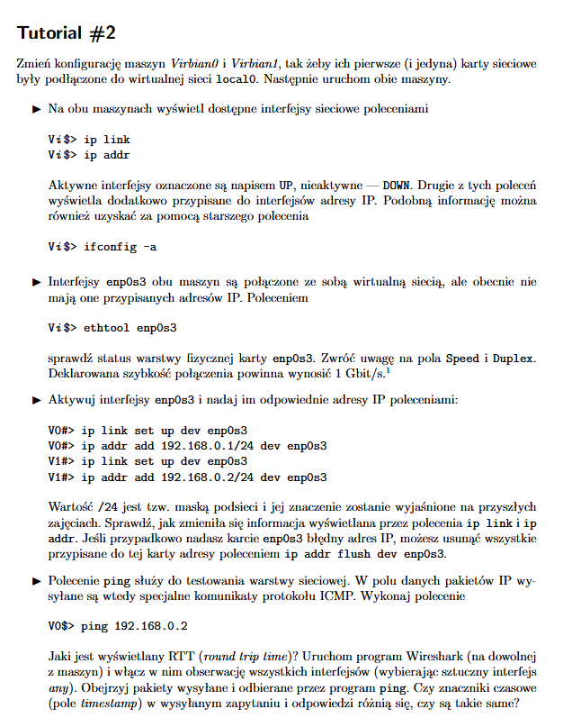
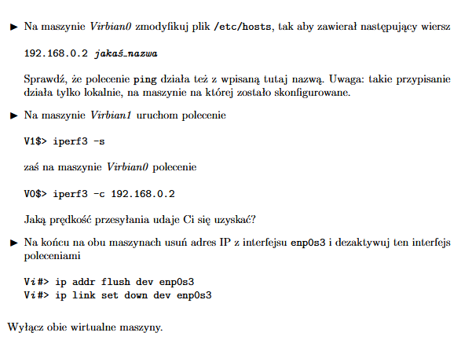

## Tutorial 1



Komendy:
```
ip addr
sudo dhclient -v enp0s3
ip addr
```

Po drugim `ip addr` do enp0s3 faktycznie został przypisany adres `10.0.2.15`, tak jak kazało polecenie.



Zostały wysłane 2 żądania:





`host -t a example.org`



Wybieramy dowolny z wypisanych adresów i wykonujemy polecenia. Po odświeżeniu możemy przefiltrować pakiety, żeby szybciej znaleźć ten z żądaniem. 



3 nagłówek zawiera informacje o IP, 4 o TCP, gdy weźmiemy pakiet z odpowiedzią, adres i port zarówno źródłowy, jak i docelowy, zamienią się miejscami.



Robimy łopatologicznie i analizujemy, co się stało. 

Komenda `nc -q 3 example.org 80 < HTTPHeaderLive.txt` umożliwia czytanie i pisanie z połączeń sieciowych poprzez TCP po 3-sekundowym opóźnieniu.



Komendy:
- `telnet example.org 80` - otwiera strumień danych do serwera,
- `netstat -l46n` - wyświetla usługi przypięte do portów,
- `netstat -l46` - to samo, tylko, że zamiast portów są nazwy usług,
- `sudo systemctl start ssh` - otwiera serwer SSH.

Dodatkowe info:
- w pliku `/etc/services` znajdują się przyporządkowania numerów portów usługom, stąd netstat je tłumaczy,
- za pomocą serwera SSH również można przesyłać dane np. strumieniem do echo.

## Tutorial 2



Komendy:
- `ip link` - wyświetla dostępne interfejsy sieciowe,
- `ip addr` - to samo, dokładniej,
- `ifconfig -a` - to samo, tylko starsze,
- `ethtool enp0s3` - sprawdza status warstwy fizycznej karty emp0s3, istotne pola: speed - powinno być 1GB/s, Duplex - powinno być Full, czyli przepływ dwustronny,
- `ip link set up dev enp0s3` - aktywacja interfejsu,
- `ip addr add 192.168.0.1/24 dev enp0s3` - nadanie adresu IP,
- `ping 192.168.0.2` - wysłanie pakietów danych do adresu w argumencie, RTT to ostatni argument wydruku (time)



Resztę robimy łopatologicznie, ważne komendy:
- `iperf3 -s` i `iperf3 -c ip` - sprawdzenie prędkości przesyłania jednego urządzenia za pomocą drugiego,
- `ip addr flush dev enp0s3` - usunięcie wszystkich adresów IP,
- `ip link set down dev enp0s3` - dezaktywacja interfejsu.

## Wyzwanie 1

Robić tak samo jak tutorial 2, te same komendy, tylko inne adresy, virbiany i karty XD

