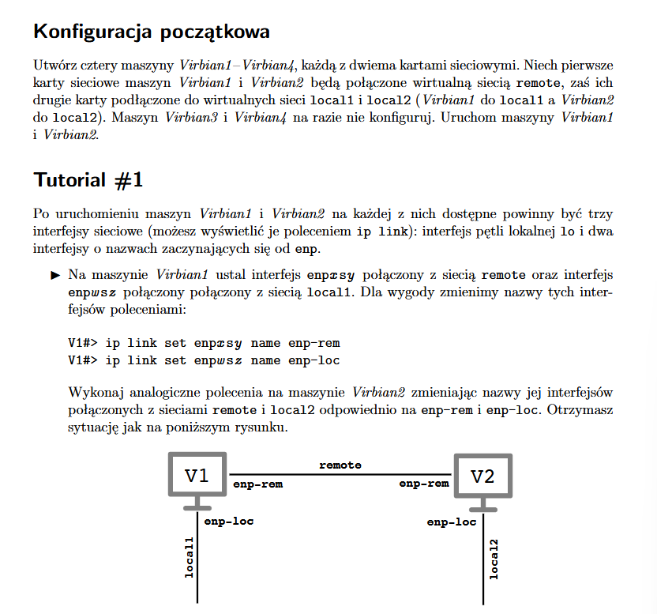
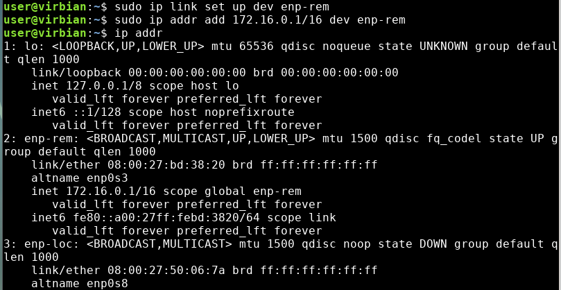
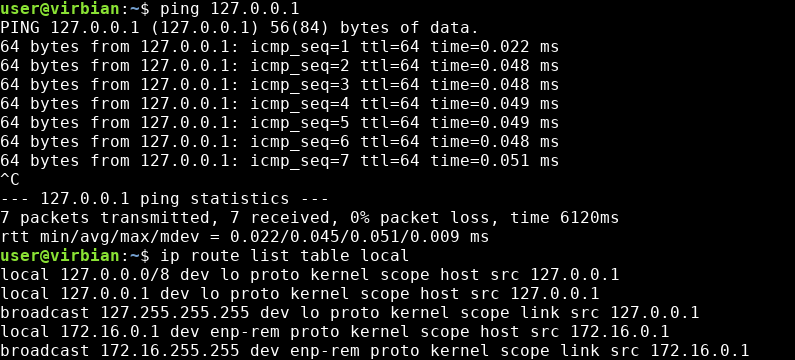

## Tutorial 1

Po `ip link` (na obu virbianach):

`sudo ip link set enp0s3 name enp-rem` - zmienia nazwę interfejsu enp0s3 na enp-rem. Rezultat na obu virbianach:

V1:

V2:

`ip route` - wyświetla tablicę routingu zawierającą trasy do sieci.

`ip route list table local` - wyświetla lokalną tablicę routingu

Zadanie z pingowaniem (wykonywane na V1):
- `ping 127.0.0.1` - lokalne pingowanie, czasy zbliżone (lokalność), jedynie pakiety request-reply wszystko tylko na V1,
- `ping 172.16.0.1` - podobnie, bo pingujemy sami siebie,
- `ping 172.16.0.2` - na V1 i V2 wyświetlane są pakiety request-reply i pytania o IP, trochę większe różnice czasów,
- `ping 172.16.255.255` - zaczyna się od reply, V2 odpowiada,
- `ping 172.16.0.0` - destination host unreachable, pytania o adres widoczne na V1 i V2.
- `ping 10.10.10.10` - nic się nie wyświetla, network is unreachable

## Tutorial 2

Po wpisaniu komend takich, jak powyżej w V3 i V4 mamy:

`sudo sysctl net.ipv4.ip_forward` - włącza przekazywanie pakietów IP między interfejsami (maszyna wirtualna może pełnić rolę routera).

Po aktywacji wymienionych w poleceniu interfejsów i nadaniu ip mamy taką konfigurację:

Pingując V4 z V1 wysyłamy pakiety, ale nie otrzymujemy odpowiedzi. Dzieje się tak, ponieważ konfiguracja została przeprowadzona poprawnie tylko w jedną stronę - V4 nie może dotrzeć do V1 przez V2, bo nie jest połączona z enp-loc V1. Dzięki komendzie `sudo ip route add default via 192.168.12.1` umożliwiliśmy pakietom dotarcie w dowolne miejsce, jeśli dostarczymy je do interfejsu podłączonej bezpośrednio maszyny.

Po wszystkich krokach trasy routingu z V3 do V4 i z powrotem wyglądają poprawnie:

## Wyzwanie 1

Po konfiguracji nazw i IP maszyny wyglądają tak:

Po konfiguracji routingu sytuacja wygląda tak:

`ping 8.8.8.8` na V2 dochodzi do V0, ale nie ma odpowiedzi, ponieważ V0 nie wie, że ma przekazać pakiety z sieci `192.168.1.0/24` dalej.

