## Konfiguracja początkowa

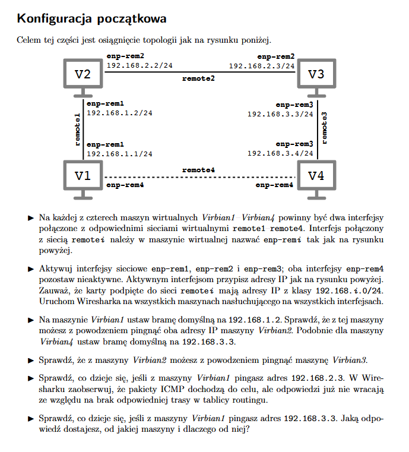

V1:
```
sudo ip link set enp0s3 name enp-rem1
sudo ip link set enp0s8 name enp-rem4
sudo ip link set dev enp0s3 up
sudo ip addr add dev enp-rem1 192.168.1.1/24
```

V2: 
```
sudo ip link set enp0s3 name enp-rem2
sudo ip link set enp0s8 name enp-rem1
sudo ip link set dev enp0s3 up
sudo ip link set dev enp0s8 up
sudo ip addr add dev enp-rem2 192.168.2.2/24
sudo ip addr add dev enp-rem1 192.168.1.2/24
```

V3:
```
sudo ip link set enp0s3 name enp-rem3
sudo ip link set enp0s8 name enp-rem2
sudo ip link set dev enp0s3 up
sudo ip link set dev enp0s8 up
sudo ip addr add dev enp-rem3 192.168.3.3/24
sudo ip addr add dev enp-rem2 192.168.2.3/24
```

V4:
```
sudo ip link set enp0s3 name enp-rem4
sudo ip link set enp0s8 name enp-rem3
sudo ip link set enp0s8 up
sudo ip addr add dev enp-rem3 192.168.3.4/24
```

Po konfiguracji:

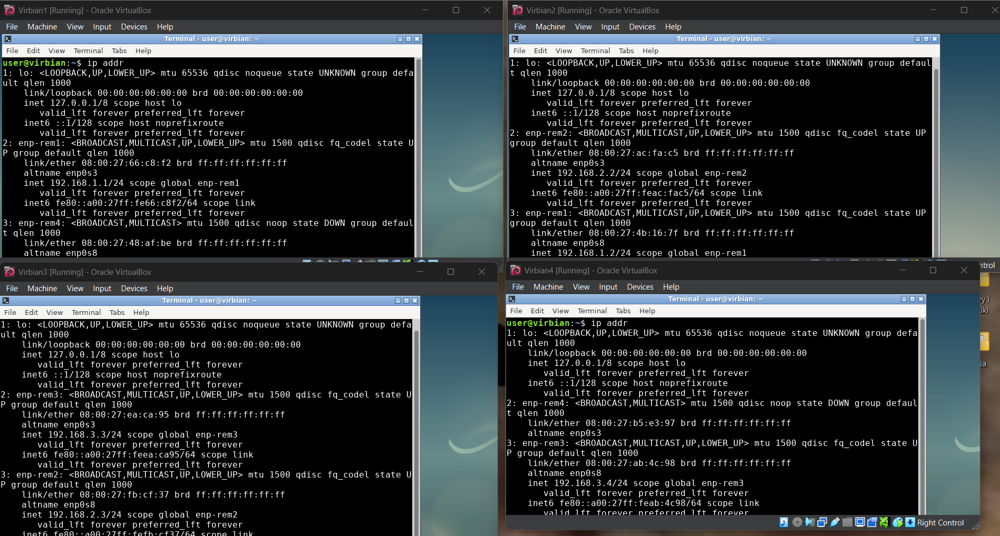

Pozostałe polecenia:

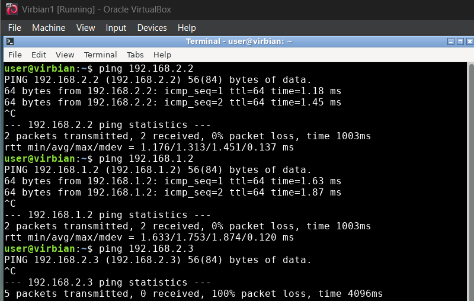

Ostatnie polecenie:

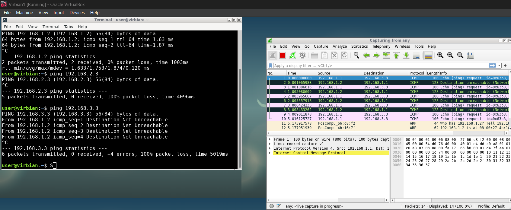

Czemu tak? Bo 192.168.1.2 jest ustawiona jako default, do niej idzie pakiet i nie wie co z nim dalej zrobić.

## Tutorial 1

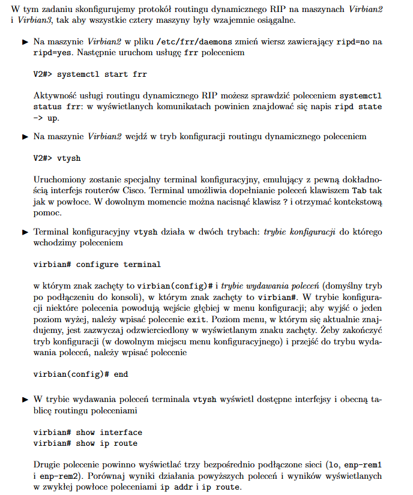

Odpalanie:
```
sudo sed -i -e 's/ripd=no/ripd=yes/g' /etc/frr/daemons
sudo systemctl start frr
sudo vtysh
```

Useful komendy w środku:
```
configure terminal
end
show interface
show ip route
```

Co wyszło?

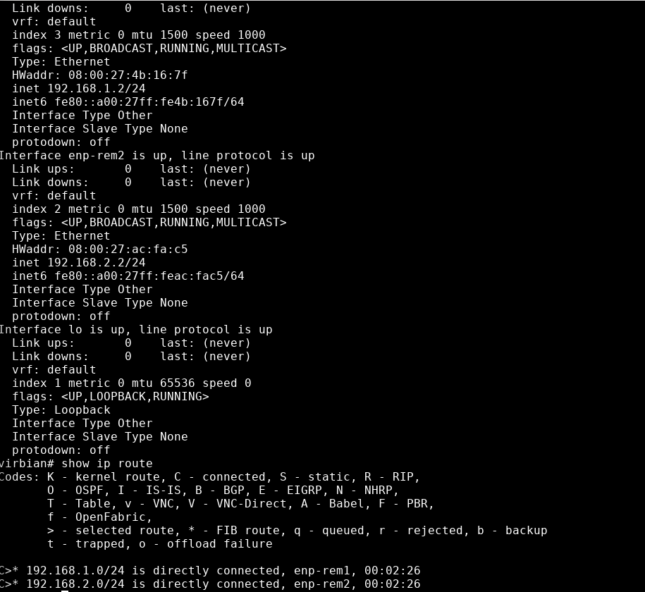

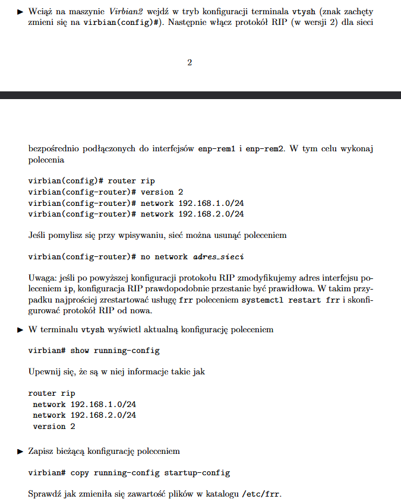

Komendy:
```
configure terminal
router rip
version 2
network 192.168.1.0/24
network 192.168.2.0/24
no network ADRES (usuwanie)
end
show running-config
copy running-config startup-config
```

Co wyszło?

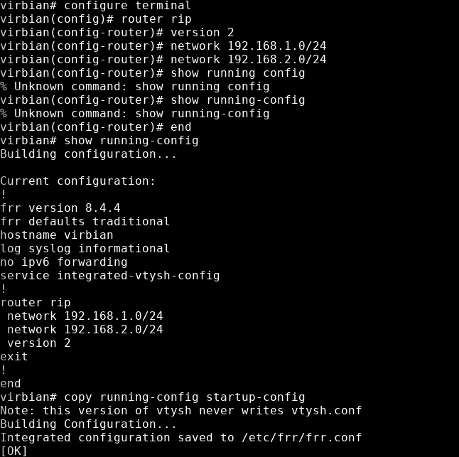

Dla V3 robimy to samo, `show ip rip` daje nam:

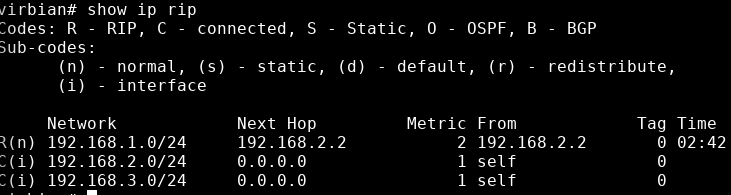

Wynik ostatnich komend tutorialu 1:

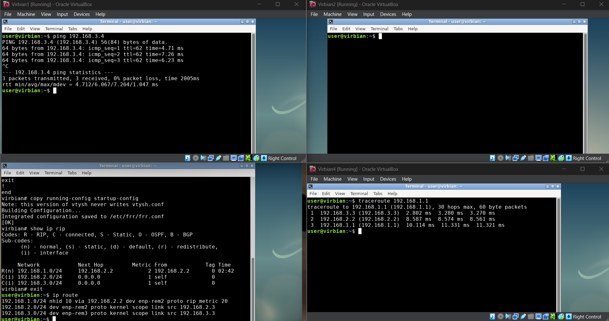

## Tutorial 2

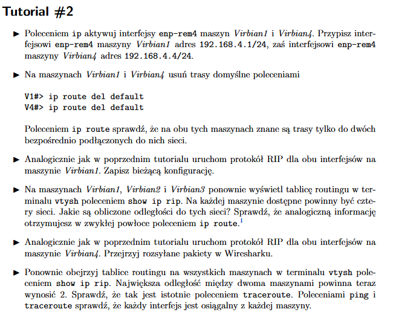

V1 i V4:
```
sudo ip link set up dev enp-rem4
sudo ip addr add 192.168.4.1/24 dev enp-rem4 (V1)
sudo ip addr add 192.168.4.4/24 dev enp-rem4 (V4)
sudo ip route del default
ip route
```

Po wykonaniu poleceń na V1:
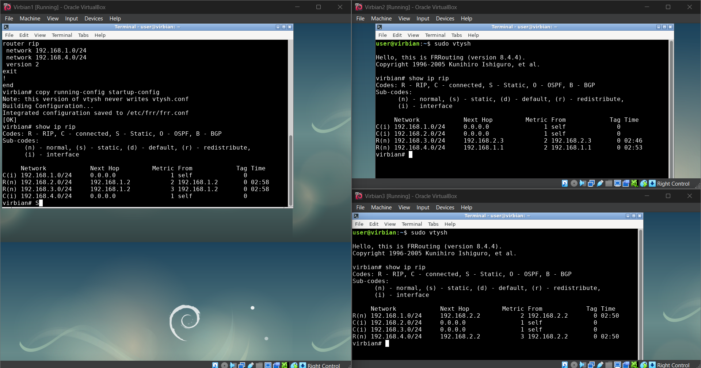

Po wykonaniu poleceń na V4 (odległość faktycznie wszędzie jest max 2):
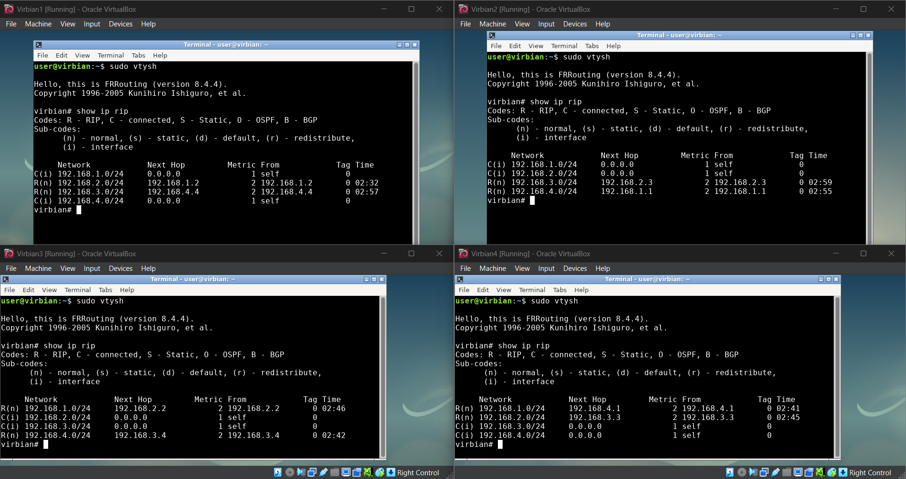

Faktycznie, po wyłączeniu enp-rem2 wydruk `sudo ip rip` zmienia się na:
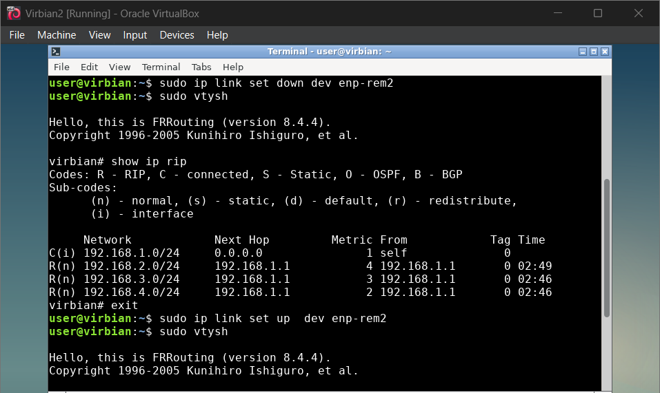

## Wyzwanie

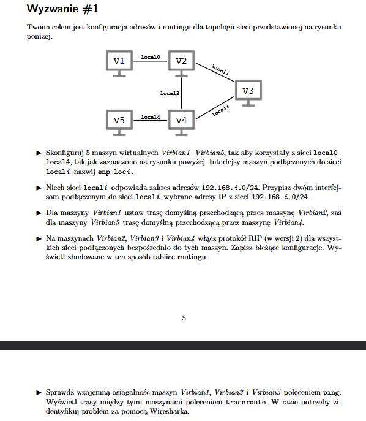

Komendy do setupu:

V1:
```
sudo ip link set enp0s3 name enp-loc0
sudo ip link set up dev enp-loc0
sudo ip addr add 192.168.0.1/24 dev enp-loc0
```

V2:
```
sudo ip link set enp0s3 name enp-loc0 & sudo ip link set enp0s8 name enp-loc1 & sudo ip link set enp0s9 name enp-loc2
sudo ip link set up dev enp-loc0 & sudo ip link set up dev enp-loc1 & sudo ip link set up dev enp-loc2
sudo ip addr add 192.168.0.2/24 dev enp-loc0 & sudo ip addr add 192.168.1.2/24 dev enp-loc1 & sudo ip addr add 192.168.2.2/24 dev enp-loc2
```

V3:
```
sudo ip link set enp0s3 name enp-loc1
sudo ip link set enp0s8 name enp-loc3
sudo ip link set up dev enp-loc1
sudo ip link set up dev enp-loc3
sudo ip addr add 192.168.1.3/24 dev enp-loc1
sudo ip addr add 192.168.3.3/24 dev enp-loc3
```

V4:
```
sudo ip link set enp0s3 name enp-loc2 & sudo ip link set enp0s8 name enp-loc3 & sudo ip link set enp0s9 name enp-loc4
sudo ip link set up dev enp-loc2 & sudo ip link set up dev enp-loc3 & sudo ip link set up dev enp-loc4
sudo ip addr add 192.168.2.4/24 dev enp-loc2 & sudo ip addr add 192.168.3.4/24 dev enp-loc3 & sudo ip addr add 192.168.4.4/24 dev enp-loc4
```

V5:
```
sudo ip link set enp0s3 name enp-loc4
sudo ip link set up dev enp-loc4
sudo ip addr add 192.168.4.5/24 dev enp-loc4
```

Po włączeniu RIP na V2, V3 i V4 mamy:

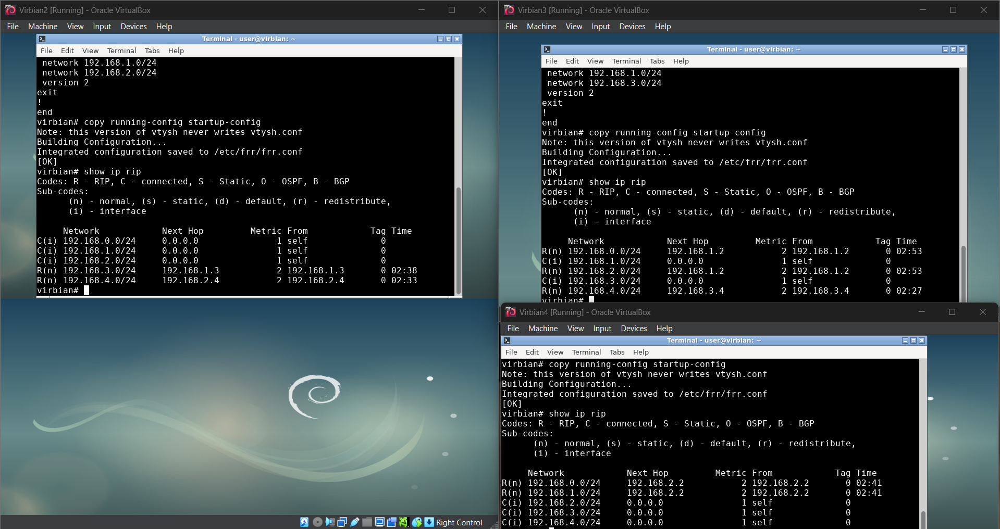

V1, V3 i V5 są wzajemnie osiągalne, dowód:

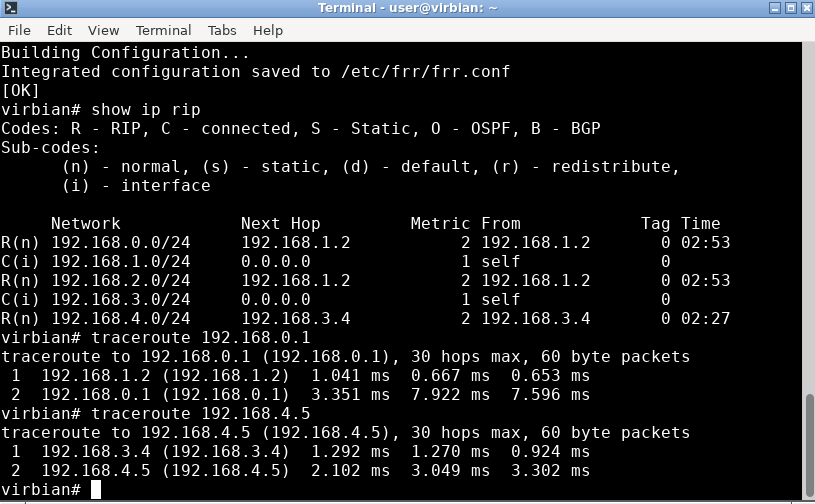