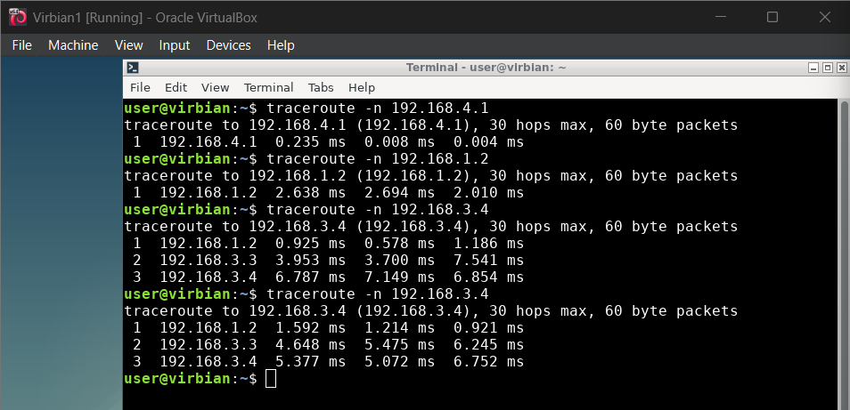

## Konfiguracja początkowa


V1:
```
sudo ip link set enp0s3 name enp-rem1 & sudo ip link set enp0s8 name enp-rem4 & sudo ip link set enp0s9 name enp-all
sudo ip link set up dev enp-rem1 & sudo ip link set up dev enp-rem4
sudo ip addr add 192.168.1.1/24 dev enp-rem1 & sudo ip addr add 192.168.4.1/24 dev enp-rem4
```

V2:
```
sudo ip link set enp0s3 name enp-rem1 & sudo ip link set enp0s8 name enp-rem2 & sudo ip link set enp0s9 name enp-all
sudo ip link set up dev enp-rem1 & sudo ip link set up dev enp-rem2
sudo ip addr add 192.168.1.2/24 dev enp-rem1 & sudo ip addr add 192.168.2.2/24 dev enp-rem2
```

V3:
```
sudo ip link set enp0s3 name enp-rem2 & sudo ip link set enp0s8 name enp-rem3 & sudo ip link set enp0s9 name enp-all
sudo ip link set up dev enp-rem2 & sudo ip link set up dev enp-rem3
sudo ip addr add 192.168.2.3/24 dev enp-rem2 & sudo ip addr add 192.168.3.3/24 dev enp-rem3
```

V4:
```
sudo ip link set enp0s3 name enp-rem3 & sudo ip link set enp0s8 name enp-rem4 & sudo ip link set enp0s9 name enp-all
sudo ip link set up dev enp-rem3 & sudo ip link set up dev enp-rem4
sudo ip addr add 192.168.3.4/24 dev enp-rem3 & sudo ip addr add 192.168.4.4/24 dev enp-rem4
```


## Tutorial 1


```
V1: sudo ip route add default via 192.168.1.2
V2: sudo ip route add default via 192.168.2.3
V3: sudo ip route add default via 192.168.3.4
V4: sudo ip route add default via 192.168.4.1
```

W tym przypadku jest cykl, bo pingujemy maszynę niepołączoną bezpośrednio:


W tym nie, bo jesteśmy bezpośrednio połączeni:


Po `ping 192.168.3.4` z V1:



## Tutorial 2


```
sudo nano /etc/frr/daemons
sudo systemctl start frr
sudo vtysh
show ip route
```


```
configure terminal
router ospf
network 192.168.x.0/24 area 0
end
show running-config
copy running-config startup-config
```


Po puszczeniu `sudo ip route` dla wszystkich maszyn:


```
sudo ip link set up dev enp-all
sudo ip addr add 172.16.16.x dev enp-all
ip addr
```


Trasy w `frr`:


Trasy w `ip`:


Mamy ścieżkę 300 po komendach:

```
V1: 
sudo ip link set down dev enp-all
sudo ip link set down dev enp-rem4 (tyle starczy do 300)
V2:
sudo ip link set down dev enp-rem2
V3: 
sudo ip link set down dev enp-rem2
V4:
sudo ip link set down dev enp-all
```


I długości 4:


## Wyzwanie


V0:
```
sudo ip link set enp0s3 name enp-ext
sudo ip link set enp0s8 name enp-loc1
sudo ip link set enp0s9 name enp-add1
sudo dhclient enp-ext
sudo ip link set up dev enp-loc1
sudo ip addr add 172.18.0.1/16 dev enp-loc1
sudo ip link set up dev enp-add1
sudo ip addr add 192.168.0.1/24 dev enp-add1
```

V1:
```
sudo ip link set enp0s3 name enp-loc1
sudo ip link set up dev enp-loc1
sudo ip addr add 172.18.0.2/16 dev enp-loc1
sudo ip route add default via 172.18.0.1
```

V2:
```
sudo ip link set enp0s3 name enp-add1
sudo ip link set up dev enp-add1
sudo ip addr add 192.168.0.2/24 dev enp-loc1
```


