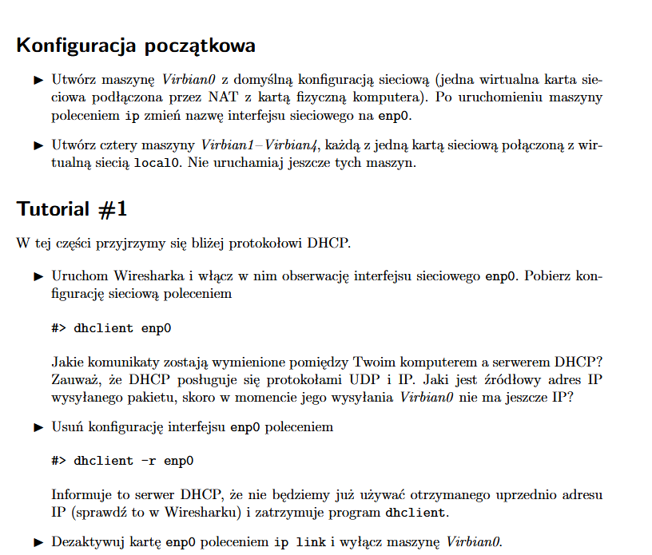

## Konfiguracja + Tutorial 1



Komendy do setupu:
```
sudo ip link set enp0s3 name enp0
sudo ip link set up dev enp0
sudo dhclient enp0
```


Co widzimy? Że zostały wysłane DHCP offer, discover, request i ACK. Źródłowy adres IP to 0.0.0.0, bo nie ma jeszcze przydzielonego.


Dezaktywacja:
```
sudo dhclient -r enp0
```


## Tutorial 2


Setup:
```
sudo ip link set enp0s3 name enp0
sudo ip link set up dev enp0
sudo ip addr add 192.168.0.1/24 dev enp0 (V1)
sudo ip addr add 192.168.0.2/24 dev enp0 (V2)
```

Po `ping 192.168.0.2`:


Po `ping -b 192.168.0.255` z V1:


Po zabawie z `ip neigh`:


Odpowiedzi na pytania:
- stan tablicy ARP w V1 zmienił się ze STALE na REACHABLE, w V2 nie zmienił się, dalej był STALE,
- przekształcone adresy IP na MAC w sieci lokalnej,
- zapytania są wysyłane na adres rozgłoszeniowy, widać na screenie,
- odpowiedzi są wysyłane na adres komputera, również na screenie

## Tutorial 3


```
sudo ip addr del 192.168.0.2/24 dev enp0 && sudo ip addr add 192.168.0.123/24 dev enp0
```


Usuwanie adresów:
```
sudo ip addr flush dev enp0
```

## Wyzwanie


V1:
```
sudo ip addr add 192.168.1.1/24 dev enp0
```

V2:
```
sudo ip addr add 192.168.1.2/24 dev enp0
```

V3:
```
sudo ip link set enp0s3 name enp0
sudo ip link set enp0s8 name enp1
sudo ip link set up dev enp0     
sudo ip link set up dev enp1
sudo ip addr add 192.168.1.3/24 dev enp0
sudo ip addr add 192.168.2.1/24 dev enp1
```

V4:
```
sudo ip link set enp0s3 name enp-out 
sudo ip link set up dev enp-out      
sudo ip addr add 192.168.2.1/24 dev enp-out
```


Trasy:
```
sudo ip route add default via 192.168.1.2 (V1)
sudo ip route add default via 192.168.1.3 (V2)
sudo ip route add default via 192.168.2.1 (V4)
```


Pytania:
- sugerowana modyfikacja to zmiana default na 192.168.1.3,
- ma to sens, bo skracamy ścieżkę,
- wykrywa problem, bo wie, że oba są w tej samej sieci, więc mogą się komunikować bezpośrednio


