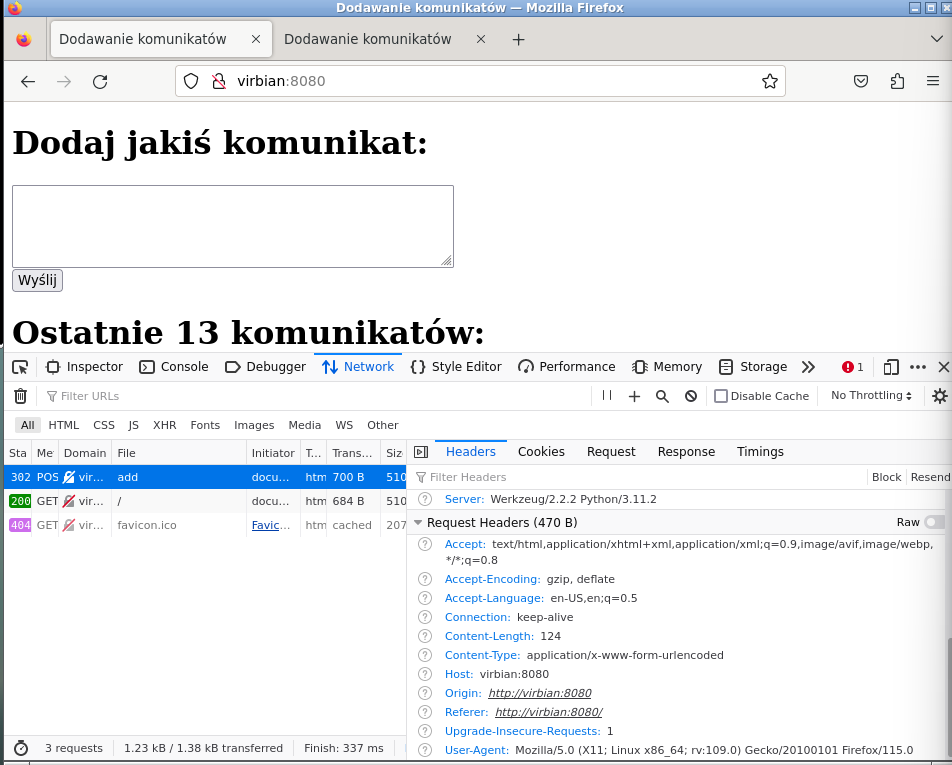

## Tutorial 1


Po `host -a www.debian.org` mamy:


Bierzemy 130.89.148.77.

Po komendach:
```
(while true; do netstat -tan | grep 130.89.148.77; done) | tee tcp_log
trickle -d 10 wget http://130.89.148.77/
```

Dostaliśmy:


Po odpaleniu wiresharka:


Co tu się dzieje:
- klient wysyła SYN,
- dostaje SYN, ACK,
- odpowiada ACK,
- nawiązuje się połączenie,
- wysyła żądanie get pod wskazane IP, żeby pobrać stronę,
- odpowiedź serwera ACK, że otrzymał GET,
- otrzymanie strony w HTML,
- wysłanie serwerowi potwierdzenia otrzymania strony,
- klient wysyła FIN, ACK,
- serwer odpowiada ACK,
- a potem ACK FIN,
- klient przechodzi w TIME_WAIT, wysyła ACK

W tcp_log są widoczne stany SYN_SENT, ESTABLISHED, FIN_WAIT2 i TIME_WAIT. To klient wykonuje otwarcie aktywne i zamknięcie aktywne, bo pierwszy wysyła segmenty do serwera.


## Tutorial 2


Po `dig www.cs.uni.wroc.pl @198.41.0.4` mamy:


Teraz `dig www.cs.uni.wroc.pl @194.0.25.29`:


`dig www.cs.uni.wroc.pl @156.17.254.3`:


`dig www.cs.uni.wroc.pl @156.17.87.193`:


`dig www.cs.uni.wroc.pl @156.17.4.1`:


Czyli dokopaliśmy się do www.cs.uni.wroc.pl.

Po `dig +trace -4 www.cs.uni.wroc.pl @198.41.0.4` jest podobnie, tylko wybierał inne adresy, ale również trafił do celu:


Wireshark:


Dalsze komendy:
```
dig -t a ii.uni.wroc.pl
dig -t ns ii.uni.wroc.pl
dig -t mx ii.uni.wroc.pl
dig -t ptr 11.4.17.156.in-addr.arpa
```

Wyniki 2 pierwszych:


Wyniki pozostałych:


## Tutorial 3


Komendy:
```
nc -u -l -p 10053 | tee dns_request
dig -p 10053 www.wikipedia.pl @127.0.0.1 +tries=1
hexdump -C dns_request 
nc -q 1 -u 8.8.8.8 53 < dns_request
```


## Wyzwanie 1


Po wielowierszowym zapytaniu:



Po zmianach w connection settings:


Nie ma response, bo serwer proxy jest nieznany.

Co zostało zapisane do http_request?


Wszystkie komunikaty są:

